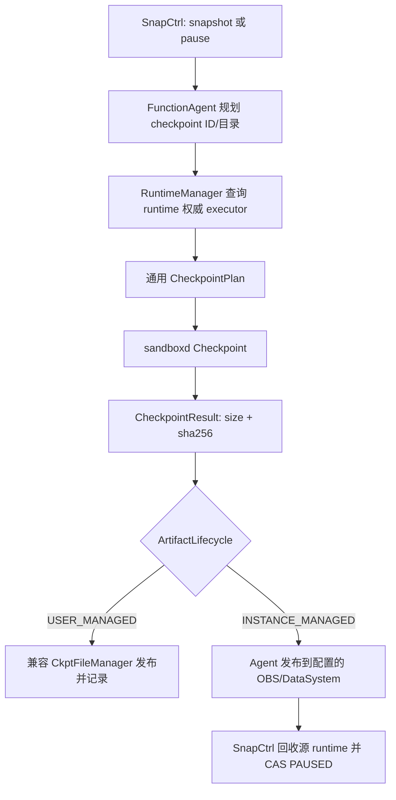

<!--
Copyright (c) Huawei Technologies Co., Ltd. 2026. All rights reserved.
Licensed under the Apache License, Version 2.0.
See the LICENSE file in this repository for the complete license text.
-->

# FS-Pause-Checkpoint-20260817：Pause/Checkpoint 数据面收敛

| 字段 | 值 |
|---|---|
| 编号 | FS-Pause-Checkpoint-20260817 |
| 状态 | 已实施并完成分级验收，待评审 |
| 作者 | ChamberlainJI（特性分支） |
| SIG / 模块 | openYuanRong FunctionSystem、sandboxd |
| 评审人 | FunctionSystem 与 AKernel 维护者 |
| 批准人 | 待评审 |
| 创建日期 | 2026-08-17 |

## 摘要

本设计将 Pause 定义为“通用 Checkpoint 原语 + 实例托管制品策略 +
`RUNNING -> PAUSED` 生命周期编排”，而不是独立的 checkpoint 数据面协议。
RuntimeManager 始终按 runtime 的权威 executor 执行物理 checkpoint；FunctionAgent
负责从本节点配置选择 OBS 或 DataSystem、校验并发布不可变制品；SnapCtrl 负责 gate、
Delete 竞争、源 runtime 回收和 ETCD 状态收敛。该边界删除节点私有 journal、下层路径
回传及重复身份状态，同时保持跨节点 deterministic Resume、CAS winner 和精确清理语义。

## 背景与动机

Pause/Resume v1 已具备跨节点恢复所需的 ETCD 状态和 sandboxd 物理能力，但 Pause
曾沿 SnapCtrl、FunctionAgent、RuntimeManager 和 SandboxdExecutor 形成独立分支：

- RuntimeManager 可以按业务类型覆盖 runtime 原 executor，错误地把请求强制送往 sandboxd；
- 空 `checkpointDir` 被当成内部路径规划哨兵；
- RuntimeManager 响应回传节点本地 artifact path，并反向声明逻辑存储后端；
- Delete 接管同时维护 lifecycle phase、布尔标志和无人等待的 terminal promise；
- Pause context 和 Agent pending context 保存多份可由冻结请求重建的 identity/key/response；
- GetClient/PrepareSnap 的固定间隔重试缺少 deadline，Delete 可能永久等待。

这些问题扩大了协议表面，也让相同物理 checkpoint 在普通 snapshot 与 Pause 中具有不同
错误和重放语义。PR #958 检视将无限 Prepare 重试列为合入阻断项，并要求恢复 executor
权威选择、显式路径/生命周期策略和单一 per-instance 状态。

### 目标

- 普通 snapshot 与 Pause 均通过 `CheckpointPlan -> CheckpointResult` 调用同一物理
  checkpoint；定向单元测试必须同时覆盖两种 lifecycle。
- RuntimeManager 只使用 runtime 注册/对账得到的 executor；缺失 runtime 或不支持的
  executor 返回明确错误，不发生业务类型改道。
- FunctionAgent 以启动配置和实际 `SnapshotStorage` 依赖为后端权威；Pause 在
  RuntimeManager 不回传 storage/path 时仍可成功发布。
- SnapCtrl 只用 `InstanceLifecycleState.phase` 表达 Pause/Delete 所有权；Delete 能取消
  checkpoint 前的 Prepare，并等待已发生副作用的阶段完成收敛。
- 每个结果未知窗口分别读取 sandboxd、远端对象或 ETCD 的对应权威事实，不通过本地
  journal、固定 sleep 或猜测状态完成流程。
- 完整 `pause_resume_unit_test` 零失败，并通过 RRT standalone 和北京四跨节点 E2E。

### 非目标

- 不把 Pause 内部 snapshot 暴露为新的用户可命名 snapshot API。
- 不为 FunctionAgent、RuntimeManager、Frontend 或 checkpoint root 新增持久 journal。
- 不改变 sandboxd 的端口分配算法，也不要求恢复后的 host port 与源端口不同。
- 不引入 Traefik publication barrier；数据面继续使用 SandboxRouter。
- 本轮保留普通 snapshot 的 `CkptFileManager` 发布兼容层，不同时重写其用户生命周期。
- 不以 SDK sleep、盲目重试或保留源 FunctionProxy 身份掩盖路由或状态缺陷。

## 方案概述

调用方仍使用原有 snapshot/pause/resume 接口。内部根据 artifact 生命周期选择后处理，
但 checkpoint 的 sandbox 选择、目录、ID、`leave_running` 和结果校验使用同一契约。



Pause 物理 checkpoint 使用 `leave_running=true`。这不是 Pause 的最终 runtime 状态，
而是补偿边界：只有不可变制品发布和校验成功后，SnapCtrl 才精确释放源 runtime 并提交
PAUSED；checkpoint 或发布失败时仍可恢复 gate，让源实例继续运行。

### 约束与注意事项

- ETCD 是逻辑实例、READY SnapshotInfo、attempt、version CAS 和最终 winner 的权威。
- sandboxd 是 sandbox、checkpoint manifest、实际端口和 runtime 是否存在的物理权威。
- 本地 `checkpoint.img` 只是不具备独立权威性的制品缓存，必须按 exact identity 清理。
- FunctionProxy、FunctionAgent 与 RuntimeManager 当前按 merge-process 部署；actor 间仍需
  generation 防止旧响应完成新请求，但 generation 在 Agent 边界清除。
- Pause 当前只支持具备 sandboxd checkpoint 能力的 runtime；非支持 executor 必须显式失败。

### 风险与缓解措施

| 风险 | 缓解措施 |
|---|---|
| Checkpoint RPC 响应丢失，调用方不知道 sandbox 状态 | 只将结果标为 unknown，并用 sandboxd List 返回的真实物理状态分类；List 不推测 artifact 成功 |
| 存储 Put/Publish 响应丢失 | Stat immutable final key，比对完整 metadata；一致视为重放成功，冲突 fail-closed |
| Delete 与 Pause 并发导致重复释放或悬挂 | SnapCtrl mailbox 内以 lifecycle phase 和 generation 单一仲裁，多个 Delete 复用同一 preparation future |
| CAS 响应丢失 | 同步 ETCD 权威 InstanceInfo，区分 exact PAUSED、源仍 RUNNING 和 identity changed |
| 本地路径被替换或越界 | 目录由 Agent 规划；FunctionSystem 与 sandboxd 校验 canonical path，文件操作使用 no-follow/固定目录句柄 |
| 新旧内部消息混用 | 保留 proto field number/name 为 reserved；Agent-local generation 不向上游泄露 |

## 详细设计

### 1. 权威数据与内部类型

`CheckpointPlan` 是进入 executor 前完成的冻结输入：

```cpp
struct CheckpointPlan {
    std::string sandboxID;
    std::string checkpointID;
    std::string checkpointDirectory;
    int32_t ttlSeconds;
    ArtifactLifecycle lifecycle; // USER_MANAGED / INSTANCE_MANAGED
    bool leaveRuntimeRunning;
};

struct CheckpointResult {
    Status status;
    int64_t size;
    std::string sha256;
};
```

`CheckpointResult` 不包含节点路径、存储 URL 或逻辑实例状态。sandboxd 返回的
`artifact_path` 只在物理边界内用于验证它等于请求目录下的 `checkpoint.img`，验证后即丢弃。

### 2. Checkpoint 计划与 executor 选择

1. FunctionAgent 在请求 RuntimeManager 前生成安全 checkpoint ID 和绝对目录。
2. RuntimeManager 从已注册/对账的 runtime 记录解析 executor。
3. runtime 不存在时返回 not-found；executor 不具备 Pause 能力时返回明确 unsupported/参数错误。
4. SandboxdExecutor 为两种 lifecycle 构造相同 `CheckpointPlan` 并调用
   `CheckpointLocal`。
5. `USER_MANAGED` 进入现有 `CkptFileManager` adapter；`INSTANCE_MANAGED` 将物理
   size/sha 返回 Agent，由 Agent 发布。

业务类型只决定 lifecycle 和上层后处理，不决定 runtime 属于哪个 executor。

### 3. Pause artifact 发布

Agent 在请求入口完成以下冻结：

- 由 tenant hash、instanceID 和 requestID 规划 source artifact path；
- 从 concrete `SnapshotStorage` 或启动配置解析 `obs`/`datasystem`；
- 保存 create time、runtime manager identity 和 actor-local generation。

RuntimeManager 成功响应只需 checkpointID、size 和 sha256。Agent 不读取下层 storage，
也不接收下层本地 path。`SnapshotArtifactPublisher` 的目标行为为：

1. 以 no-follow 方式打开并校验本地文件，计算实际 size/sha256；
2. 实际事实必须与 sandboxd 返回事实一致；
3. 写 attempt-scoped temporary key；
4. conditional publish immutable final key；
5. Publish 结果未知时 Stat final key 并比对完整 metadata；
6. 只把 READY SnapshotInfo 返回 SnapCtrl。

正常首次发布不预先 Stat，因此不会固定增加一个远端 RTT。只有失败、冲突或重放窗口读取
final key 收敛。

### 4. Pause 与 Delete 单一状态机

SnapCtrl 每个 instance 只保存一个 `InstanceLifecycleState`：

```text
PAUSING(GATE -> PREPARE -> CHECKPOINT -> CONVERGING)
PREPARING_DELETE(generation, shared preparation future)
```

`PrepareForAuthorizedDelete(instanceID)` 在 actor mailbox 内完成所有权转换：

- 无活动 Pause：直接创建 PREPARING_DELETE 并返回 generation；
- 正在 PREPARE：停止新 Prepare/Checkpoint，完成 Pause，再交付同一 generation；
- 已进入 checkpoint/发布/CAS：Delete 等待该副作用窗口读取权威事实并收敛；
- 已有 Delete：复用原 preparation future。

`FinishAuthorizedDelete(instanceID, generation)` 只允许当前 generation 释放 lifecycle。
Pause context 不再保存并行 `deleteRequested`、terminal promise 或重复 source identity。

### 5. Pause 提交与失败恢复

发布完成后的目标流程为：

```text
Release exact source runtime/checkpoint
→ CAS RUNNING(N) -> PAUSED(N+1)
→ owner = InstanceManagerOwner
→ 清空 runtime/agent/container/unit/portForward
→ 保留 READY SnapshotInfo 和 PAUSED routeInfo
→ finalize temporary artifact
```

关键失败窗口：

- Checkpoint 失败且 List 为 RUNNING：恢复 SnapStarted/gate，源实例继续服务。
- Checkpoint 失败且 List unknown：保持 result unknown 并重试读取，不删除可能存在的制品。
- Runtime release 返回 transport error：按 exact source identity 重试，不构造新 runtime。
- CAS 返回 transport error：同步 ETCD；exact PAUSED 继续 finalize，exact RUNNING 重试 CAS，
  identity changed 则只清本 attempt artifact。
- Actor shutdown：完成对外 promise 为明确失败；已发生的外部副作用依赖权威事实继续由重放/
  对账收敛，不由无人等待的本地 promise 表示。

### 6. Resume 保持的架构语义

Resume 仍由 Master 读取 ETCD 中 PAUSED + READY SnapshotInfo 并选择目标 Proxy/Agent。
目标使用 deterministic attempt/runtime ID，先查询 sandboxd exact sandbox；存在时采用真实物理
事实，不存在时幂等 Restore。只有 ETCD CAS winner 发布 RUNNING owner、runtime/agent/container
和端口映射；loser 只删除自己的 sandbox、restore cache 和资源。FunctionAgent 重启后从 ETCD
逻辑事实与 sandboxd 物理事实重建，不读取 checkpoint root journal。

### 7. 兼容性

- `SnapshotRuntimeResponse.localArtifactPath` 的 field number/name 均 reserved，禁止复用。
- 原 correlation token 改为 Agent-local monotonic generation，并在响应离开 Agent 前清除。
- 普通 snapshot 继续使用现有 storage URL 和 `CkptFileManager` 引用计数。
- sandboxd 删除未发布的 timeout/compress/trace/success/message 字段和 transient lifecycle enum
  时保留 wire number/name，避免未来误复用。
- sandboxd 的 restore identity、resource facts 和 cleanup sentinel 位于 internal 包/持久模型，
  不进入公共 runtime Handler 或 List API。

### 测试计划

- 单元测试以状态不变量为中心：两种 lifecycle 共用 plan；executor 权威选择；Agent 不依赖
  runtime path/storage；immutable publish replay/冲突；Delete 在各 Pause phase 接管；CAS
  result-unknown 分类；actor shutdown 和 stale generation。
- 集成测试使用真实 DataSystem 和临时 OBS bucket 验证 Put/Publish/Stat/Get/Delete，并注入响应
  丢失，证明重放读取同一 final object。OBS bucket 在证据复制后删除。
- RRT standalone E2E 从 sandbox-sdk 执行 create、文件/内存/阻塞进程、公开端口、Pause、
  Delete 或 Resume、循环与交叉实例；检查 checkpoint.img、资源视图和分段耗时。
- 北京四在全新 namespace 内运行同节点和资源不足跨节点 Resume，覆盖成功与失败；测试请求
  必须从集群内 Pod 发出，不借用编译 ECS 作为数据面客户端。
- 完成门槛为全部启用 `pause_resume_unit_test` 零失败、基础与分级 E2E 证据完整、无未解释
  checkpoint.img/ETCD route/端口/资源泄漏。

### 升级与回滚策略

FunctionSystem 与 sandboxd 的 checkpoint wire 变更必须随同一 AKernel 镜像部署。升级前保留
现有 PAUSED SnapshotInfo；新版本能从 ETCD 和 sandboxd 读取并恢复。若新 Pause 路径异常，
停止发起新的 Pause，等待进行中 attempt 收敛后回滚镜像；不得删除已有 READY snapshot 或
清空 PAUSED route。已 reserved 的 proto 字段不会在回滚过程中承载新语义。

## 生产就绪评审

- 不新增特性开关；回滚边界是停止新 Pause 后替换 FunctionSystem/sandboxd 镜像。
- 日志必须包含 operation requestID、instanceID、source version、attempt/runtime ID 和收敛分类，
  不记录 AK/SK、token 或 OBS credential。
- 观测项包括 Checkpoint、publish、runtime release、CAS、Resume restore/readiness 的分段耗时，
  以及 result-unknown、replay、CAS loser 和 exact cleanup 计数。
- checkpoint root 必须具有足够空间；缓存清理由 exact finalize 和启动对账负责，不能用不区分
  identity 的目录扫描删除活动 attempt。
- 外部依赖为 sandboxd、ETCD、DataSystem 或 OBS；各自失败只由对应权威读操作收敛。

## 实施历史

- 2026-08-17：根据 PR #958 检视创建收敛设计与实施计划。
- 2026-08-18：完成 executor 权威选择、通用 checkpoint、Agent-owned artifact 发布、单一
  lifecycle phase 和内部状态清理；FunctionSystem 520 项测试中 519 passed、1 个真实 OBS
  凭据集成项 skipped、0 failed。RRT standalone、北京四 DataSystem/OBS、跨节点与资源不足
  矩阵通过，最终双节点 `checkpoint.img=0` 且 pause/restore 空业务目录已收敛。

## 缺点

- 普通 snapshot 暂时仍由 `CkptFileManager` 发布，物理调用已统一但发布实现尚未完全合并。
- Pause 只支持 sandboxd/RRT；为其他 executor 增加能力时必须实现同一 plan/result 契约和
  明确的 artifact 物理事实，不能再次按业务类型改道。
- 结果未知路径会增加权威读请求；这是避免误删或双 winner 的必要可靠性成本。

## 备选方案

- 保留独立 Pause checkpoint RPC：拒绝。它复制普通 checkpoint 的路径、校验和错误语义，
  并继续扩大跨层特殊分支。
- 在 FunctionAgent/checkpoint root 写 attempt journal：拒绝。Agent 本地盘不是逻辑或物理
  权威，跨节点和 Agent 重启后会产生第三份不可协调事实。
- 由 RuntimeManager 响应声明 OBS/DataSystem 和节点路径：拒绝。RuntimeManager 不拥有逻辑
  storage 配置，且节点路径不应越过物理执行边界。
- Delete 立即清理所有未知制品：拒绝。RPC/CAS 响应丢失时会破坏仍在运行的 source 或 winner。

## 基础设施需求

- Linux x86 ECS 仅用于 `--cpus=20`、`-j20` 的 FunctionSystem 编译和 LLT，不承载北京四测试流量。
- standalone E2E 使用 RRT/Rust Runtime，不使用 Python runtime 替代验证。
- Kubernetes 验证使用北京四集群的新 namespace，不修改其他 namespace；大镜像按已授权 LRU
  策略清理节点缓存。
- OBS 测试创建独立临时 bucket，验收证据复制后删除。
