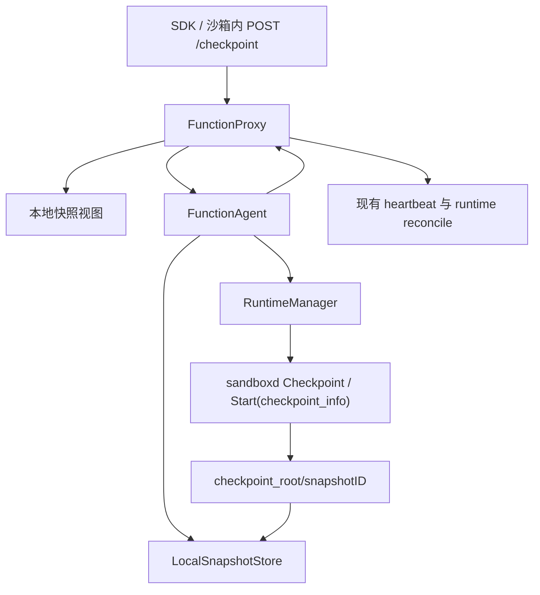

<!--
Copyright (c) Huawei Technologies Co., Ltd. 2026. All rights reserved.
Licensed under the Apache License, Version 2.0.
See the LICENSE file in this repository for the complete license text.
-->

# FS-Local-Snapshot-Failover-20260826：沙箱本地快照与同节点故障恢复

| 字段 | 值 |
|---|---|
| 编号 | FS-Local-Snapshot-Failover-20260826 |
| 状态 | 可实施 |
| 作者 | ChamberlainJI |
| SIG / 模块 | openYuanRong FunctionSystem、RRT、Frontend、Sandbox SDK |
| 评审人 | FunctionSystem、RRT、Frontend 与 AKernel SDK 维护者 |
| 批准人 | ChamberlainJI（需求方） |
| 创建日期 | 2026-08-26 |

## 摘要

本设计在现有 Checkpoint/Pause/Resume 能力上增加节点侧统一的本地快照目录、
FunctionAgent 本地快照枚举与精确删除、FunctionProxy 实例快照视图，以及基于最新匿名
快照的同节点自动故障恢复。所有本地制品统一为
`<checkpoint_root>/<snapshotID>/checkpoint.img` 和原子提交的 `snapshot.meta`；Pause
只是匿名快照的一种上层触发方式，不形成独立的本地制品类型。实例通过显式持久化的
`failover` 布尔值选择是否在 sandbox 异常退出后原地恢复，恢复期间 InstanceInfo 保持
RUNNING，不新增状态或恢复事务 journal。Proxy 重启通过 FunctionAgent 列举本地制品并
复用现有 runtime reconcile 收敛物理状态。主动 `Sandbox.reload()` 复用同一恢复入口，
只返回成功与否，并作为最后实施阶段交付。沙箱内同步 `POST /checkpoint` 使用可配置的 RRT
控制 socket；Proxy 先确认接管请求，再执行 PrepareSnap，RRT 在 checkpoint handoff 读取完成
后才返回 HTTP 200。验证中发现的 POSIX 恢复后单向断流属于 gVisor
TAP RX 循环错误退出；运行时依赖必须包含 fdbased `readVDispatcher` 外来帧丢弃修复，不能
通过主动轮换控制流规避。

## 背景与动机

现有 Pause、普通 Snapshot 和 Restore 已共享 sandboxd Checkpoint/Restore 原语，但节点侧
制品存在多套目录和生命周期：普通 Snapshot 使用 checkpoint root 下的 snapshot ID，
Pause source、Resume attempt 和 reusable Snapshot materialization 又分别使用嵌套路径。
这些路径由不同组件规划和清理，Proxy 重启后也不能从 FunctionAgent 重新获知“本节点
有哪些可恢复快照”。

现有 runtime recovery 通过 `RecoverRetryTimes` 执行普通 redeploy，无法恢复 sandbox
内存、文件系统和进程状态。用户需要的是另一种明确语义：在 sandbox 内主动建立一个
本地恢复点，sandboxd Wait 返回、RRT 心跳丢失或用户后续主动 reload 时，继续在原节点、
原 FunctionAgent 上用该恢复点重拉 sandbox，而不是跨节点冷启动。

本设计补充 2026-08-17 Pause/Checkpoint 设计。该设计关于远端不可变制品、PAUSED ETCD
状态和跨节点 Resume 的权威边界保持不变；本设计仅覆盖节点侧制品目录、匿名快照视图和
同节点恢复。`snapshot.meta` 是已完成快照制品的提交记录，不记录 operation phase、重试
次数或恢复 intent，因此不是 FunctionAgent 恢复事务 journal。

### 目标

- 所有可恢复的节点侧 checkpoint 均落在
  `<checkpoint_root>/<snapshotID>/checkpoint.img`，测试验证 Pause、匿名 checkpoint、
  reusable Snapshot materialization 和 restore 都不再规划业务类型专属路径。
- FunctionAgent 能从 checkpoint root 枚举完整快照并精确删除指定制品；Proxy/Agent 重启
  测试必须能重建 `instanceID -> latest anonymous snapshotID` 视图。
- RRT 在沙箱内提供同步 `POST /checkpoint`；每个实例在
  Proxy 视图中最多有一个当前匿名快照，新快照提交前不得删除旧快照。
- SDK 创建参数 `failover` 以显式 bool 持久化到 InstanceInfo；`failover=true` 且存在
  本地匿名快照时，sandboxd Wait、RRT 心跳丢失及启动对账发现物理 sandbox 缺失均触发
  同节点 restore。
- 恢复复用现有 Deploy/RuntimeManager/sandboxd Start 路径；InstanceInfo 在恢复期间保持
  RUNNING，最终不可恢复时才进入现有 FATAL 流程。
- 最后阶段提供 `Sandbox.reload() -> bool`，原 Sandbox 对象、逻辑 instanceID 和已完成的
  CommandResult 在调用后仍可使用。

### 非目标

- 不处理节点宕机、本地盘丢失或跨节点 failover；既有 Pause/Resume 与 reusable Snapshot
  的远端存储能力继续负责跨节点制品传输。
- 不新增 RECOVERING 或 RELOADING 实例状态，不持久化恢复 intent，也不为 checkpoint root
  增加操作 journal。
- 不为 reload/failover 新增流量 gate；恢复窗口内请求可能连接失败或超时。
- 不把 `RecoverRetryTimes` 解释为本地快照恢复开关，也不在本地快照缺失时无状态冷启动。
- 不保证 reload 期间已经在等待的 HTTP、PTY 或 WebSocket 请求透明续接。
- 不新增 sandboxd 快照注册、ListSnapshot 或 DeleteSnapshot API；sandboxd 仍只处理调用方
  指定目录中的物理 Checkpoint 和 restore Start。

AKernel node 将 checkpoint root 固定为现有 node home disk 下的
`/home/akernel/checkpoints`。这只保证同一物理节点上的 Pod 重建不丢文件，不提供跨节点或节点
磁盘故障恢复，也不新增持久卷类型。Kubernetes node 角色同时使用 downward API 的
`NODE_NAME` 作为稳定 YuanRong nodeID；DaemonSet Pod hostname 变化不改变本地恢复归属。

## 方案概述

### 用户接口

创建时选择自动恢复：

```python
from akernel_sdk import Sandbox

sb = Sandbox(image="python:3.12-slim", failover=True)
```

沙箱内建立恢复点：

```bash
curl --unix-socket /run/openyuanrong/rrt.sock \
  -X POST http://localhost/checkpoint
```

Helm 参数 `rrtControlSocketPath` 映射到 node 环境变量
`YR_RRT_CONTROL_SOCKET_PATH`；`yuanrong.service` 通过 `PassEnvironment` 将它传给
FunctionSystem，再注入沙箱环境。RRT 监听
`${YR_RRT_CONTROL_SOCKET_PATH}/rrt.sock`；变量未配置或为空时不创建控制 socket。
`POST /checkpoint` 在 Proxy ACK 且 checkpoint handoff 文件读取完成后返回 HTTP 200。
主动 reload 在最后实施阶段提供：

```python
ok: bool = sb.reload()
```

`reload()` 不返回新的 Sandbox 或 command handler。`True` 表示 restore、RRT
`SnapStarted` 和心跳恢复均完成；`False` 表示操作失败或结果无法确认。

### 组件边界



- FunctionProxy 选择 snapshotID、维护本地视图并决定何时 checkpoint 或 restore，不传节点
  文件路径。
- FunctionAgent 负责路径解析、meta 提交、List/Delete、文件完整性验证和远端制品物化。
- RuntimeManager 负责把可信目录转换为 sandboxd Checkpoint/Start 请求并维护运行时内存状态。
- sandboxd 是物理 sandbox 权威，但不拥有快照命名、目录、meta、枚举和保留策略。

### 约束与注意事项

- FunctionProxy、FunctionAgent 和 RuntimeManager 的节点本地调用为可信内部边界。恢复不以
  `snapshot.meta.instanceID` 做授权或原实例绑定；Proxy 可以将同一快照用于 Resume、
  create-from-snapshot、failover 或 reload。
- `snapshot.meta.instanceID` 仅用于重建匿名快照视图、精确清理和排障。
- 本地 failover 必须选择当前 FunctionAgent 上的快照；Agent 不可用时不调度到其他节点。
- 恢复应复用原 InstanceInfo 中的环境、资源、mount、网络和端口配置。若既有 Deploy 路径
  返回新的必要物理事实，继续由现有 UpdateInstance 逻辑处理，本设计不新增字段更新协议。

### 风险与缓解措施

| 风险 | 缓解措施 |
|---|---|
| 新 checkpoint 失败后误删旧恢复点 | 只有 checkpoint.img 校验和 meta 原子提交完成后才切换 Proxy 视图，视图切换后才精确删除旧 snapshotID |
| Proxy 重启时磁盘上存在新旧两个匿名快照 | meta 保存同实例单调 generation；List 后选择 generation 最大者，旧项异步精确删除 |
| checkpoint root 出现半成品或符号链接 | List 仅接受安全叶目录和完整 meta；Restore 前再次执行 no-follow、size、SHA 与兼容性校验 |
| Wait 与心跳同时触发两次恢复 | InstanceCtrl 使用最小 `recoveringInstances_` 集合去重，不新增 phase 状态机 |
| Proxy 在 restore 中途重启 | 不恢复内存 context；FunctionAgent 注册后先重建快照视图，再由现有 runtime reconcile 判断 sandbox 存在或缺失 |
| 恢复期间请求仍被路由到 RUNNING 实例 | 明确接受短暂连接失败/超时；本期不增加 traffic gate |
| 快照恢复后立即再次崩溃形成循环 | 使用现有可配置恢复预算；预算耗尽进入 FATAL，不回退到无状态 redeploy |
| 本地盘空间不足时无法同时保留新旧快照 | 新 checkpoint admission 失败并保留旧快照；禁止为了腾空间先删除当前恢复点 |
| bridge 将旧沙箱 MAC 的残留单播帧泛洪到恢复后的 TAP | gVisor 丢弃不属于当前 endpoint 的帧并继续 RX 循环；单测和真实 TAP 注入验证后续合法帧仍可接收 |

## 详细设计

### 1. 本地目录与提交记录

每个本地快照使用唯一、不可嵌套的 snapshotID：

```text
<checkpoint_root>/<snapshotID>/
├── checkpoint.img
└── snapshot.meta
```

`snapshot.meta` 使用 UTF-8 JSON，schema v1 定义为：

```json
{
  "schemaVersion": 1,
  "snapshotID": "anon-c108...",
  "anonymous": true,
  "instanceID": "default-sandbox-a",
  "tenantHash": "7f83...",
  "sourceRuntimeID": "runtime-a",
  "sourceSandboxID": "sbox-runtime-a",
  "sourceInstanceVersion": 12,
  "generation": 3,
  "runtimeClass": "runsc",
  "architecture": "x86_64",
  "artifactFormat": "sandboxd-checkpoint-v1",
  "artifactFormatVersion": 1,
  "size": 1048576,
  "sha256": "64-lowercase-hex-characters",
  "createdAtUnixSeconds": 1787670000
}
```

字段语义：

- `anonymous=true` 表示该制品参与实例最新匿名快照视图。Pause 与 `/checkpoint` 均设置为
  true；本地存储不区分二者。
- `generation` 由 FunctionAgent 在同 instanceID 的本地 store 锁内分配，等于现存完整匿名
  快照最大 generation 加一；Proxy 不持久化计数器。
- `instanceID` 和 source identity 是目录归属与排障事实，不限制恢复目标。
- runtime/architecture/format 是 Restore 前的兼容性事实。

提交协议：

1. `Prepare(snapshotID)` 校验 snapshotID 是安全单段名称并创建空 leaf 目录；完整同 ID 制品
   与请求事实一致时返回幂等成功，不一致时返回冲突。
2. RuntimeManager 将 leaf 目录传给 sandboxd Checkpoint；sandboxd 成功输出
   `checkpoint.img`。
3. FunctionAgent 以 no-follow 方式打开文件，校验 regular file，计算 size/SHA 并 fsync。
4. FunctionAgent 在同目录写 `snapshot.meta.tmp`，fsync 后原子 rename 为 `snapshot.meta`，
   再 fsync 目录。
5. `snapshot.meta` 的存在是 READY 提交标志。只有 checkpoint.img 的目录不进入 List 和
   Restore；它在确认不属于 in-flight 请求后按宽限期清理。

删除协议重新打开目录和两个文件，比对 snapshotID、generation、size 与 SHA 后执行删除；
不存在视为幂等成功，事实冲突则保留目录并返回 `SCHEDULE_CONFLICTED`。

### 2. FunctionAgent 本地存储接口

FunctionAgent 新增 `LocalSnapshotStore`，内部接口为：

```cpp
struct LocalSnapshotDescriptor {
    std::string snapshotID;
    bool anonymous{false};
    std::string instanceID;
    uint64_t generation{0};
    std::string runtimeClass;
    std::string architecture;
    uint64_t size{0};
    std::string sha256;
    int64_t createdAtUnixSeconds{0};
};

class LocalSnapshotStore {
public:
    LocalSnapshotPrepareResult Prepare(const LocalSnapshotCommitRequest &request);
    LocalSnapshotCommitResult Commit(const LocalSnapshotCommitRequest &request);
    std::vector<LocalSnapshotDescriptor> List();
    Status ValidateForRestore(const std::string &snapshotID,
                              LocalSnapshotDescriptor &descriptor);
    Status Delete(const LocalSnapshotDeleteIdentity &identity);
};
```

`Prepare`、`Commit` 和 `ValidateForRestore` 是 FunctionAgent 内部方法，不形成新的 Proxy RPC。
跨 Agent/Proxy actor 边界只新增：

```proto
message ListLocalSnapshotsRequest {
  string requestID = 1;
}

message ListLocalSnapshotsResponse {
  int32 code = 1;
  string message = 2;
  string requestID = 3;
  repeated LocalSnapshotMetadata snapshots = 4;
}

message DeleteLocalSnapshotRequest {
  string requestID = 1;
  string snapshotID = 2;
  uint64 expectedGeneration = 3;
  uint64 expectedSize = 4;
  string expectedSha256 = 5;
}

message DeleteLocalSnapshotResponse {
  int32 code = 1;
  string message = 2;
  string requestID = 3;
}
```

恢复通过现有 Deploy 边界新增的 snapshotID 字段完成：

```proto
message DeployInstanceRequest {
  // existing fields...
  string restoreSnapshotID = 42;
}

message RuntimeInstanceInfo {
  // existing fields...
  string restoreSnapshotID = 14;
}
```

Proxy 仅下发 snapshotID。FunctionAgent 在 Deploy 内调用 `ValidateForRestore`，再把可信绝对
目录写入 RuntimeManager 内部 Start 请求。需要从 OBS/DataSystem 获取 Pause 或 reusable
制品时，既有 materialization 逻辑在 FunctionAgent 内部下载到同一平面目录并提交 meta，
不增加 `GetLocalSnapshot` 或 `EnsureLocalSnapshot` actor API。

### 3. Proxy 本地快照视图

Proxy 保存：

```cpp
class LocalSnapshotView {
public:
    void ReplaceAgentSnapshots(
        const std::string &functionAgentID,
        const std::vector<LocalSnapshotDescriptor> &snapshots);
    std::optional<LocalSnapshotDescriptor> LatestAnonymous(
        const std::string &instanceID) const;
    void RecordCommitted(const std::string &functionAgentID,
                         const LocalSnapshotDescriptor &snapshot);
    void Remove(const std::string &snapshotID);
};
```

内部维护 `snapshotID -> descriptor` 和
`instanceID -> latest anonymous snapshotID`。`RecordCommitted` 只在 FunctionAgent 返回完整
meta 事实后更新视图；若旧 snapshotID 存在，先让新项成为 latest，再发 Delete 请求。

Agent 注册/重注册流程调整为：

```text
FunctionAgent Register 成功
→ FunctionAgentMgr ListLocalSnapshots
→ LocalSnapshotView.ReplaceAgentSnapshots
→ RuntimeReconcileActor.TriggerOnce
```

首次 runtime reconcile 不得早于本地视图重建，否则 RUNNING 实例的 missing runtime 无法
判断是否具备 failover 恢复点。对同一实例存在多个完整匿名快照时选 generation 最大者；
generation 相同且 snapshotID 不同视为冲突，不猜测 winner。

### 4. Pause、普通 Snapshot 与本地匿名快照

三者使用相同物理调用：

```text
Proxy 选择 snapshotID/anonymous/leaveRunning
→ FunctionAgent LocalSnapshotStore.Prepare
→ RuntimeManager CheckpointPlan
→ sandboxd Checkpoint
→ FunctionAgent LocalSnapshotStore.Commit
→ 上层按操作语义继续
```

- Pause 设置 `anonymous=true` 和 `leaveRunning=true`。本地提交完成后继续既有远端发布、
  source release、PAUSED CAS 与 Delete 仲裁；现有 Pause traffic gate 不因本设计删除。
- 沙箱内 `/checkpoint` 设置 `anonymous=true` 和 `leaveRunning=true`。Proxy ACK 后调用
  PrepareSnap；提交后调用 RRT
  `SnapStarted` 并恢复心跳，源 sandbox 继续运行，不新增 traffic gate。
- reusable Snapshot 设置 `anonymous=false` 和 `leaveRunning=true`，继续既有远端不可变发布。

Pause 或 `/checkpoint` 提交的新匿名快照替换该实例之前的匿名快照。PAUSED Resume 成功后
本地匿名制品仍可作为后续同节点恢复点，直到实例产生新匿名快照或实例被删除；远端 Pause
对象继续遵守现有 TTL/Resume/Delete 规则。

### 5. RRT `POST /checkpoint`

Helm 参数 `rrtControlSocketPath` 通过 node 容器环境和 `yuanrong.service` 的
`PassEnvironment` 传给 FunctionSystem，再注入 sandbox 环境变量
`YR_RRT_CONTROL_SOCKET_PATH`。RRT 仅在变量非空时监听
`${YR_RRT_CONTROL_SOCKET_PATH}/rrt.sock`。处理约束：

1. handler 生成 requestID，通过现有 outbound RuntimeRPC channel 发送新的 core signal；
   request 中的 instanceID 只取 RRT 当前绑定身份。每个 RRT 同时只接受一个 checkpoint 请求。
2. Proxy 完成身份、归属和 RUNNING 校验后，停止该实例 heartbeat，启动现有匿名快照 future，
   并立即返回成功 KillRsp ACK；ACK 不等待 PrepareSnap、sandboxd 或本地 meta 提交。
3. RRT 收到 ACK 后继续等待，不向 HTTP 调用方返回。Proxy 随后请求 RRT `PrepareSnap`；RRT 在
   应答前等待 activity counter 归零。独立控制 socket handler 不计入该 activity counter，避免
   PrepareSnap 等待正在等待 handoff 的 HTTP 请求形成死锁。
4. RRT 从 `YR_CHECKPOINT_HANDOFF_FILE` 打开 handoff 文件，在发送成功 PrepareSnapRsp 之后读取。
   该先后关系保证 Proxy 能在收到 PrepareSnapRsp 后调用 sandboxd Checkpoint，而 RRT 已持有
   对应 generation 的 handoff 描述符。RRT 不得在读取完成前返回 HTTP 200。
5. handoff 返回 `resume` 或 `restore` 且 Proxy ACK 已收到时，HTTP handler 返回 200；Proxy 拒绝、
   activity drain、handoff 打开/读取或 handoff outcome 失败时返回非 2xx。
6. Proxy 生成 snapshotID 并调用统一 SnapshotRuntime；提交成功后发送 `SnapStarted`，恢复
   heartbeat，更新 LocalSnapshotView 并删除旧匿名快照。Checkpoint 失败时恢复 heartbeat 且
   不修改视图；source 已退出时交给 failover 决策，半成品目录不进入 List。

`YR_CHECKPOINT_HANDOFF_FILE` 和 restore environment path 来自 sandboxd
`ListAvailableRuntimes.RuntimeInfo`，FunctionSystem 不硬编码 runsc 或 Firecracker guest 路径。
HTTP 同步等待状态只存在于 RRT 内存，不是持久化 recovery intent。

core signal 使用当前未占用的编号 24，并在 FunctionSystem 与 RRT 常量表中同步，名称为
`INSTANCE_ANONYMOUS_CHECKPOINT_SIGNAL`。它不暴露为用户可指定目标实例的通用 Kill API。

### 6. `failover` 创建参数

新增显式字段：

```proto
message InstanceInfo {
  // existing fields...
  bool failover = 42;
}
```

Frontend v1 Create 和两个 Python SDK 均以 `false` 为兼容默认值，将 bool 经 typed create
request 持久化到 InstanceInfo。
不得只把它写入易丢失或易误解的 createOptions，也不得映射为 `RecoverRetryTimes`。

### 7. 同节点自动恢复

Wait、心跳和启动对账共用 InstanceCtrl 本地恢复入口：

```cpp
litebus::Future<Status> TryLocalSnapshotFailover(
    const std::string &instanceID,
    const std::string &sourceRuntimeID);
```

入口行为：

1. 读取当前 InstanceInfo，拒绝 stale sourceRuntimeID 和已在 `recoveringInstances_` 中的重复
   触发。普通路径只接受 RUNNING；同一稳定 nodeID 的重启对账允许
   `failover=true + EVICTED + runtime missing` 进入专用恢复，并在提交时规范化回 RUNNING。
2. `failover=false` 返回“未接管”，调用方继续既有 FATAL/redeploy 逻辑。
3. `failover=true` 但当前 FunctionAgent 不可用或 LocalSnapshotView 无匿名快照时返回终态
   失败，调用方进入 FATAL，不做跨节点或无状态恢复。
4. 插入 `recoveringInstances_`，停止旧 heartbeat；确认旧 sandbox 已退出，仍存在时使用现有
   Kill 路径删除并将对应 Wait 视为 expected stop。
5. 从当前 InstanceInfo 构造原节点 Deploy，设置 `restoreSnapshotID`，其余环境、资源、mount、
   网络、FunctionAgent 和端口输入不变。
6. FunctionAgent/RuntimeManager/sandboxd Start 恢复后，复用现有 UpdateInstance、client 建立、
   `SnapStarted` 和 heartbeat 启动路径。InstanceInfo 在整个窗口保持 RUNNING；现有 Deploy
   仅在实际物理事实变化时自然覆盖字段，本设计不额外写 runtimeAddress/containerID/ports。
7. 成功或失败均擦除 `recoveringInstances_`；现有恢复预算耗尽后进入 FATAL。

RuntimeReconcileActor 对 missingIDs 的处理从直接 `CleanGhostInstance` 调整为先调用上述入口。
Proxy 在恢复中途重启不重建内存集合；Agent 注册先恢复 LocalSnapshotView，随后现有 reconcile
重新读取 sandboxd 物理事实：已存在则恢复内存映射和 client，缺失则重新触发 failover。
AKernel 以 Kubernetes `NODE_NAME` 作为稳定 nodeID，并将 checkpoint root 放在现有 node home
disk。Master 的节点异常、低可靠清理和 fault-put 三个入口都保留 failover 实例并把内存状态
规范化为 RUNNING；新 Proxy 因现有异常流程读到 EVICTED 时，仅在上述同节点条件下恢复。

逻辑实例永久删除时，Proxy 用 LocalSnapshotView 中的 generation/size/SHA 向原 FunctionAgent
发精确 DeleteLocalSnapshot；reusable Snapshot 的全局删除同时清理命中节点的非匿名物化缓存。
两类清理均不影响恢复成功路径正在使用的匿名恢复点。

### 8. 主动 reload

reload 是最后实施阶段。Frontend 新增：

```text
POST /api/sandbox/v1/sandboxes/{sandboxID}/reload
```

SDK 新增：

```python
def reload(self) -> bool:
    ...
```

Proxy 在杀源前读取 LocalSnapshotView 并要求最新匿名 snapshotID 存在；缺失时返回 false 且
不影响源 sandbox。存在时通过现有 Kill 路径停止源并调用与自动 failover 相同的本地恢复
入口。SDK 保留原 Sandbox、commands、files 等 facade；逻辑 ID 不变。已完成 CommandResult
是本地不可变值，继续可读；reload 窗口内已经在等待的请求允许失败，PTY/WebSocket 可由
调用方在原 Sandbox 对象上重新建立。

### 9. 删除与垃圾回收

- 实例删除时，Proxy 根据视图向所属 FunctionAgent 精确删除当前匿名快照；不存在视为成功。
- reusable Snapshot 的用户删除继续由既有 Master/Agent 远端流程驱动，并同步删除存在的本地
  cache。
- 无 meta、meta 无法解析、路径不安全或 size 不一致的目录不自动当作有效快照；它们输出
  指标和诊断日志，并在确认没有 Agent in-flight snapshotID 后按宽限期清理。
- Store 不遍历 checkpoint root 之外的路径，不接受 symlink leaf，不以 glob 或用户路径执行
  递归删除。

### 10. 兼容性

- `failover` 缺失等价于 false；旧 SDK 与旧 InstanceInfo 保持原行为。
- 新 FunctionAgent 的 List/Delete 是内部 actor 协议。Proxy 在 Agent 不支持时记录 capability
  不可用并禁用本地 failover，不影响普通 RUNNING sandbox。
- restoreSnapshotID 仅在新 Proxy/Agent/RM 同版本链路中使用；混合版本不尝试本地 restore。
- 本地 checkpoint 必须使用相同 runtime class、architecture 和兼容 runtime binary；现阶段
  不声称跨镜像版本兼容。
- 本设计不改变 sandboxd 公共协议；FunctionSystem 应按 sandboxd 公共 Checkpoint 空响应和
  Start(checkpoint_info) 适配，size/SHA 由 FunctionAgent 本地建立。

### 11. gVisor POSIX 恢复后断流：根因与修复

#### 11.1 故障边界

该故障不是通用的“restore 后所有 gRPC 都断开”，也不是 checkpoint.img 恢复失败。恢复后的
sentry、网络接口和既有 POSIX 流可以先正常工作；故障由后续到达 TAP 的特定外来帧触发。
一次基线采样记录到以下顺序：

1. 恢复后的 guest 连续约 15 秒收发 POSIX TCP，新的 `runsc exec` TCP 探针也成功。
2. 目标 TAP 随后收到目的 MAC/IP 属于旧 guest 的单播帧。旧 MAC 已不在 bridge FDB 时，
   Linux bridge 会把这类 unknown unicast 泛洪到其他端口，包括恢复后 sandbox 使用的 TAP。
3. 此后 Proxy 发往正确新 MAC 的 TCP 包和 gateway ARP reply 仍到达 TAP，但 guest 不再 ACK，
   也不消费 ARP reply；新的 TCP 连接全部超时。
4. guest 仍能发送 ARP request，sentry 和接口保持存活，host 侧 TAP RX 计数继续增长。约一个
   gRPC keepalive 超时窗口后，Proxy 才观察到 POSIX 断链。

因此第一处失败边界是 gVisor fdbased endpoint 的 host-to-guest RX，而不是 Proxy/RRT 控制流、
sandboxd restore 响应或 bridge 到 TAP 的传输。RX 循环停止后，轮换 heartbeat/POSIX gRPC
连接仍依赖同一个已失效数据面，不能恢复通信。

#### 11.2 根因

`pkg/tcpip/link/fdbased/packet_dispatchers.go` 中 `readVDispatcher.dispatch()` 的原行为为：

```go
if !d.e.parseInboundHeader(pkt, addr) {
    return false, nil
}
```

`parseInboundHeader()` 返回 false 表示当前帧不应交付给该 endpoint，例如目的 MAC 是另一个
guest。这里的 `false` 被上层 `endpoint.dispatchLoop()` 解释为停止 dispatcher，而不是只丢弃
当前帧，导致该 TAP 的 readv RX goroutine 永久退出。包会由 defer 正常释放，sentry 本身不会
崩溃，因此外部只看到单向收包停止。

同文件的 `recvMMsgDispatcher` 已采用正确语义：不匹配的帧不入队，但循环继续。两种 dispatcher
行为不一致也是根因的代码级反证。

#### 11.3 最小修改

修改只调整“不交付当前帧”时的循环控制语义：

```go
if !d.e.parseInboundHeader(pkt, addr) {
    return true, nil
}
```

`true` 表示 dispatcher 可继续读取下一帧，不表示接受或交付外来帧。该修改不改变：

- Ethernet/MAC 过滤规则和合法帧的交付路径；
- checkpoint/restore 格式、网络状态序列化和 bridge FDB；
- sandboxd、FunctionSystem、RRT 的 API 或 heartbeat 策略；
- EOF、stopfd 和真实 readv 错误的退出行为。

该语义同样适用于 malformed/不匹配帧：丢弃单个输入不能使整个网络 endpoint 永久失去 RX。
持续异常流量仍按逐帧处理，不新增重试循环或旁路队列。

#### 11.4 回归测试与验证证据

gVisor 新增 `TestReadVDispatcherIgnoresForeignEthernetFrame`，通过真实
`readVDispatcher` 先发送目的 MAC 不匹配的 Ethernet frame，再发送目的 MAC 为本 endpoint
的 frame。测试要求外来帧不交付、`dispatch()` 返回 `(true, nil)`，随后合法帧成功交付。

验证分层如下：

- 修复前同一测试稳定失败：`dispatching foreign frame = (false, <nil>)`。
- 修复后完整 `//pkg/tcpip/link/fdbased:fdbased_test` 通过。
- ECS 使用候选 runsc 连续执行 8 轮 checkpoint/delete/restore，交替使用两个 TAP、IP 和 MAC；
  每轮恢复后的 20 秒窗口均收到 20/20 心跳。
- 在第 8 轮恢复后的活动 TAP 上主动注入目的 MAC 为旧 guest 的 frame，tcpdump 证明帧已进入
  TAP；服务端心跳计数在 12 秒内从 195 连续增长到 208，证明修复路径被真实命中且后续 RX
  未退出。
- 验证候选基于 gVisor revision `f7e81183edb0d2ed1fb81c584ae6ddc03a7769f0` 加上述一行
  修改，runsc SHA256 为
  `c602ac45fbb9341240b4ba161580692c01351f7f454e21c8d9dba27f047dc457`；薄层镜像仅替换
  `/usr/local/bin/runsc`，registry digest 为
  `sha256:6dba359b747632cfb0d20c74829e89c669237e724f89b24e1e2f8ec87440d968`。

上述证据证明 gVisor 数据面根因和最小修复成立，但不能替代 AKernel 最终质量门禁。正式发布前
仍必须完成 `/checkpoint`、`Sandbox.reload()`、旧 command handle、reusable
checkpoint/list/restore/delete 和 PID 1 failover 的完整 SDK E2E，并用保留正式版本元数据的
runsc 构建替换调试候选。

#### 11.5 发布与回滚边界

- 增量验证镜像只替换 node 角色实际执行路径 `/usr/local/bin/runsc`，不得滚动
  master/frontend，也不得从源码目录推测其他替换对象。
- 最终 runsc 必须从包含该补丁的可追溯 gVisor revision 构建，记录 source revision、二进制
  SHA 和基础镜像 digest；调试构建报告 `runsc version 0.0.0` 时不得作为正式发布物。
- 回滚恢复上一 node image digest。回滚前停止新 checkpoint/restore，清理测试 sandbox，
  并按现有 DaemonSet rollout 让旧调度成员自然淘汰。
- 节点仍需满足 AKernel 既有 `br_netfilter`、conntrack、TAP 和 bridge netfilter 前置条件；
  缺少这些宿主机能力属于节点可用性问题，不由本补丁处理。

### 测试计划

- 单元测试围绕不变量：安全平面路径、meta 原子提交、半成品过滤、generation winner、精确
  删除、同 ID replay/冲突、恢复兼容性、failover 默认 false、重复 Wait/心跳去重、missingID
  先恢复后 FATAL，以及 reload 无快照不杀源。
- 集成测试使用真实 FunctionAgent/RuntimeManager actor 边界验证 Register → List → View →
  Reconcile 顺序，注入 Agent/Proxy 重启、Checkpoint/Start 响应丢失和旧快照 Delete 响应丢失。
- RRT 测试验证控制目录为空时不绑定 UDS、socket 固定为 `rrt.sock`、outbound signal 使用自身
  instanceID、Proxy ACK 前不返回、ACK 后仍等待 handoff，以及 PrepareSnapRsp 先于 handoff read。
- sandboxd contract 测试覆盖 runsc 与 Firecracker 的 caller-owned Checkpoint 和
  Start(checkpoint_info)，确认 Start 成功后不再依赖输入目录。
- SDK/Frontend 测试验证 failover typed forwarding、默认 false、reload bool 和原 Sandbox
  facade 不替换。
- gVisor 单元测试必须在真实 `readVDispatcher` 上验证“外来帧不交付但循环继续”，不能只 mock
  `parseInboundHeader` 返回值；同一测试必须继续发送合法帧以证明 dispatcher 未退出。
- 运行时穿刺必须在真实 TAP/bridge 上覆盖 restore 后的外来 MAC 帧，并同时观察 TAP 抓包、
  guest ACK/ARP、fresh TCP probe 和持续 heartbeat，避免仅凭上层 gRPC 状态判断。
- E2E 运行 create(failover=true)、写文件/启动进程、沙箱内 `/checkpoint`、修改状态、强杀
  sandbox、自动恢复、使用原 SDK handle 执行新命令；reload 阶段再覆盖主动杀源与 bool 结果。
- 故障注入覆盖磁盘满、meta rename 前崩溃、Proxy 在视图切换前重启、Agent 重启、Wait 与
  heartbeat 竞态、恢复响应丢失和恢复后立即再次退出。

### 升级与回滚策略

升级按 FunctionSystem/RRT/Frontend/SDK 能力顺序部署，但 `failover` 默认 false，因此新路径
只有用户显式启用后才生效。升级前不迁移旧嵌套本地缓存；新 store 仅管理平面目录中带合法
meta 的快照，旧 Pause/Restore 缓存在既有生命周期下清理。

回滚前停止新的 `/checkpoint` 和 failover 请求，等待节点内 in-flight Checkpoint/Restore
结束，再回滚组件。已生成的平面目录不会被旧版本识别，也不会影响旧 sandbox 启动；运维可
在确认实例终态后按 meta 精确清理。不得让旧 CkptFileManager 扫描并接管新平面目录。

## 生产就绪评审

- 指标：按节点和 anonymous 属性统计 READY/invalid/orphan snapshot 数、占用字节，记录
  checkpoint、List、Delete、failover、reconcile restore 的成功/失败/结果未知次数和耗时。
- 日志：包含 requestID、instanceID、snapshotID、generation、sourceRuntimeID 和收敛分类，
  不记录 token、AK/SK、完整 tenant 凭据或用户环境变量。
- 容量：新快照 admission 必须允许旧匿名快照保留到新 meta 提交；空间不足返回失败而不破坏
  当前恢复点。
- 排障：FunctionAgent 启动扫描输出 invalid 目录原因；Proxy 日志输出 Agent List 版本、每个
  instance 选择的 latest snapshotID 以及 reconcile 对 missing runtime 的决策。
- 依赖：runsc 和 Firecracker 必须由 sandboxd 当前 runtime capability 明确报告 checkpoint/
  restore 支持；Kata/runc 不因 `failover=true` 绕过能力校验。
- gVisor 依赖：node 镜像必须记录包含 fdbased RX 修复的 source revision 与 runsc SHA；E2E 前在
  Pod 内复核 `/proc` 实际运行路径和二进制 SHA，禁止只依据镜像 tag 判断。

## 实施历史

- 2026-08-26：需求方确认统一本地目录、Pause 归入匿名快照、RUNNING 内存态恢复、现有
  reconcile 收敛和 reload 末期交付方案。
- 2026-08-26：创建设计文档与实施计划。
- 2026-08-26：定位 POSIX 恢复后单向断流为 gVisor `readVDispatcher` 外来帧导致 RX 循环退出，
  完成一行语义修复、fdbased 回归测试、8 轮 ECS restore 穿刺和真实 TAP 外来帧注入验证。
- 2026-08-27：按确认架构将 RRT 控制 socket 改为 Helm/环境变量驱动，并把 `/checkpoint` 改为
  Proxy ACK 与 checkpoint handoff 双条件完成后返回 HTTP 200 的同步语义。
- 2026-08-27：完成北京四集群增量 E2E，补齐持久 checkpoint root、稳定 nodeID、Master
  failover 保留策略、EVICTED 同节点对账恢复，以及匿名/reusable 本地缓存清理。

## 缺点

- InstanceInfo 在恢复期间仍显示 RUNNING，调用方只能通过请求失败、指标和日志观察恢复窗口。
- 不持久化恢复 intent 使 Proxy 重启后只能重新对账，无法向原 reload 调用返回精确终态。
- 本地 failover 不能抵抗节点或本地盘故障；用户必须使用既有远端 Snapshot/Pause 能力获得
  跨节点恢复能力。
- 平面目录要求 snapshotID 在节点内唯一；冲突必须 fail-closed，不能通过业务类型子目录规避。

## 备选方案

- 在 sandboxd 增加 ListSnapshot/元数据注册表：拒绝。sandboxd 公共设计明确让调用方拥有
  checkpoint 目录、命名和保留策略，注册表会复制 FunctionAgent 的逻辑身份和清理职责。
- 在 InstanceInfo 持久化 snapshotID/recovery intent 并新增 RECOVERING：拒绝。本期仅要求
  同节点恢复，FunctionAgent List 与现有 runtime reconcile 足以在 Proxy 重启后重新收敛。
- 为 Pause、匿名 checkpoint 和 restore attempt 保留不同目录：拒绝。它阻止按 snapshotID
  统一 Deploy，并继续扩大路径与清理分支。
- 恢复前强制校验 snapshot.meta.instanceID 等于目标实例：拒绝。Proxy 是可信选择者，且
  reusable create-from-snapshot 合法地恢复到不同实例；本地只验证物理完整性和兼容性。
- failover 快照缺失时执行普通 cold redeploy：拒绝。该行为会在用户启用状态恢复后静默丢失
  sandbox 状态；缺失或不可恢复应进入 FATAL。
- 主动轮换 POSIX/heartbeat 控制流：拒绝。故障后 fresh TCP 和 ARP reply 同样无法进入 guest，
  新连接仍复用已经退出的 TAP RX dispatcher，只会延迟暴露根因。
- 在 bridge 或 Proxy 层过滤旧 MAC 帧：拒绝。unknown-unicast 是合法 bridge 行为，且外来帧
  可能来自其他正常端口；endpoint 必须能安全丢弃不属于自己的单帧输入而不退出。

## 基础设施需求

- FunctionSystem 单元/集成构建环境需要生成更新后的 protobuf 并运行现有
  `functionsystem_unit_test`、`pause_resume_unit_test` 与 sandboxd adapter 测试。
- RRT Rust workspace 需要运行 `cargo test -p rrt-daemon`。
- Frontend 与 Sandbox SDK 分别需要 Go 单元测试和 Python 3.10+ 单元测试环境。
- E2E 需要 checkpoint-capable runsc 节点；Firecracker 覆盖另需可用 KVM 节点。
