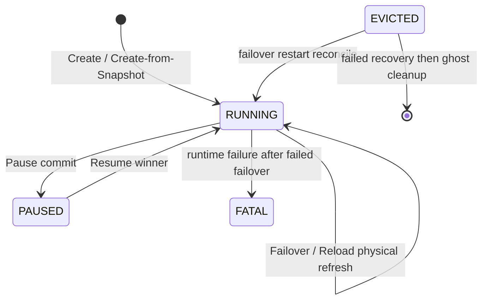

<!--
Copyright (c) Huawei Technologies Co., Ltd. 2026. All rights reserved.
Licensed under the Apache License, Version 2.0.
See the LICENSE file in this repository for the complete license text.
-->

# FS-Local-Snapshot-Failover-20260826：沙箱快照生命周期与同节点恢复

| 字段 | 值 |
|---|---|
| 编号 | FS-Local-Snapshot-Failover-20260826 |
| 状态 | 已实现 |
| 作者 | ChamberlainJI |
| SIG / 模块 | openYuanRong FunctionSystem / Snapshot、RuntimeManager、Sandbox |
| 评审人 | FunctionSystem、RuntimeManager、RRT 与 Sandbox 接口维护者 |
| 批准人 | FunctionSystem 维护者（代码评审角色） |
| 创建日期 | 2026-08-26 |

## 摘要

本设计描述已经落地的六个沙箱生命周期操作：可复用快照、从快照创建、Pause、Resume、
同节点 Failover 和主动 Reload。FunctionMaster 持久化可复用目录与 PAUSED 实例，
FunctionProxy 负责状态迁移、调度和恢复仲裁，FunctionAgent 拥有节点 checkpoint 目录及
本地/分布式发布策略，RuntimeManager 通过 sandboxd 的 `Checkpoint` 和携带
`checkpoint_info` 的 `Start` 完成物理保存与恢复。系统支持 `local_only`、
`distributed_cache`、`distributed_only` 三种模式；分布式后端为 DataSystem 或 OBS。
本地恢复只使用已有 recovery candidate，不存在时失败，不执行冷启动降级。

## 背景与动机

“快照”同时覆盖租户可复用模板、PAUSED 实例的耐久恢复点和 Failover/Reload 使用的节点
恢复候选。三者可能共享同一个 checkpoint 目录，却拥有不同的目录权威、放置规则和清理
终点。若把本地目录、分布式对象和 FunctionMaster 元数据视为同一层事实，会错误地允许
跨节点访问 `local` artifact，或在发布结果未知时删除仍可能有效的恢复点。

当前实现还允许以本地为默认存储，并把 sandboxd 生成的多文件目录视为 opaque artifact。
因此本文以当前代码而非历史实施步骤为准，固定状态、所有权、fencing、缓存、重启和失败
边界。

### 目标

- 为六个操作给出可验证的前置条件、状态变化、artifact 语义、放置和成功边界。
- 明确 `local_only`、`distributed_cache`、`distributed_only` 以及 DataSystem/OBS 的行为。
- 保证同一请求重放、PAUSED/READY CAS、恢复候选和清理均由稳定 identity/版本约束。
- Restore 统一经 `SandboxService.Start(StartRequest.checkpoint_info)`，恢复后由
  `SnapStarted` 重启 RRT listener。
- 大目录不通过 LiteBus 传输 payload；本地目录、打包、压缩、上传和恢复均由文件路径及固定
  大小缓冲区处理。

### 非目标

- 不提供本地磁盘丢失后的恢复保证；`local` artifact 不能跨节点。
- 不在缺少 recovery candidate 时执行 Failover/Reload 冷启动。
- 不持久化 FunctionAgent 的本地 artifact 索引，也不从裸目录重建完整业务元数据。
- 不新增专用 Restore、Capture 或 Finalize sandboxd RPC。
- 不承诺 Reload/Failover 期间现有 HTTP、PTY、WebSocket 或反向隧道透明续接。
- 不承诺具体时延、吞吐或压缩率。

## 方案概述

### 用户操作矩阵

| 操作 | 用户入口 | 核心前置条件 | 状态与 artifact | 放置与结果 |
|---|---|---|---|---|
| 可复用快照 | `Sandbox.create_snapshot(name=None, timeout_seconds=300)`；`POST /api/sandbox/v1/sandboxes/{id}/snapshots` | 源实例 identity 完整且当前可运行；活动反向隧道被拒绝 | 源保持 RUNNING；Master 记录 `PUBLISHING -> READY` 模板与 artifact | 本地 artifact 强制回源节点；DataSystem/OBS artifact 可供其他节点 materialize |
| 从快照创建 | `Sandbox.create(snapshot_id, **kwargs)`；普通 Create 携带 `snapshotId` | 同租户 READY 记录；函数一致 | 保留新逻辑 identity；复制模板 workload 字段，显式资源保留、缺失资源继承 | `local` artifact 注入 required node affinity；分布式 artifact 正常调度 |
| Pause | `Sandbox.pause(ttl_seconds=90000, timeout_seconds=300)`；`POST /api/sandbox/v1/sandboxes/{id}/pause` | 当前 owner 的 RUNNING generation | `leave_running=false` 创建 recovery candidate；发布后 CAS 为 PAUSED，清除物理字段 | local-only Resume 固定源节点；分布式 Resume 对源节点为 preferred affinity |
| Resume | `Sandbox.resume()`；`POST /api/sandbox/v1/sandboxes/{id}/resume` | 权威 PAUSED identity 和完整 SnapshotInfo | 目标 materialize/pin，Start restore，`SnapStarted`，CAS RUNNING | 返回 winner route、Proxy、node 和端口；loser 精确释放 |
| Failover | Create 时 `failover=true`，没有独立 imperative API | RUNNING，或同节点重启对账中的 EVICTED；已有 local recovery candidate | 停止源 runtime，恢复最新 candidate，刷新同一逻辑实例的物理字段 | 固定原 Proxy/Agent/node；候选缺失或恢复失败不降级 |
| Reload | `Sandbox.reload()`；`POST /api/sandbox/v1/sandboxes/{id}/reload`；legacy `yr.reload_instance(id)` | 当前 RUNNING owner；已有 local recovery candidate；不要求 `failover=true` | 与 Failover 共用恢复路径，显式允许 RUNNING 物理 refresh | 固定原 Agent/node；返回成功或失败，不创建新逻辑 sandbox |

SDK timeout 缺省值来自 `YR_GET_DEFAULT_TIMEOUT=300`，`checkpointTimeoutMs` 的已实现范围为
1..3,600,000 毫秒。FunctionSystem 把它按秒向上取整后传给 sandboxd
`CheckpointRequest.timeout_seconds`，同时分别用同一数值为 Proxy→Agent 的物理 checkpoint 响应
和 publication 响应建立等待窗口。这些等待超时不会主动取消 Agent 中已经开始的压缩或远端发布；
迟到响应、重放和 final Stat 仍按 result-unknown 路径收敛。原始 HTTP handler 与 SDK 的其他参数
校验仍各自负责：raw Snapshot/Pause 的 `timeoutSeconds` 都默认 300、校验 `1..3600`、换算后转发；
只有这两个 body 当前接收调用方逻辑 timeout。SDK 每个 transport attempt 使用逻辑 timeout 加
30 秒缓冲，Reusable Snapshot 只发一次，Pause 使用 lifecycle retry。Pause raw HTTP 的零 TTL
仍使用默认值。

### 三类业务 artifact

| 类别 | 本地记录 | 逻辑权威 | 用途 |
|---|---|---|---|
| 可复用 artifact | `recoveryCandidate=false`，`returnArtifact=true` | FunctionMaster READY catalog，artifact backend 可为 local/obs/datasystem | 后续 Create；local artifact 带 sourceNodeID |
| Pause artifact | `recoveryCandidate=true`，权威 SnapshotInfo 随 PAUSED InstanceInfo 持久化 | PAUSED InstanceInfo | Resume；同时可成为源节点恢复候选 |
| 内部 checkpoint artifact | `internalCheckpoint=true`、`recoveryCandidate=true`，始终 local | FunctionAgent 内存索引与 Proxy LocalSnapshotView | 可成为 local recovery candidate；不远端发布 |

Failover/Reload 的持久术语是“最新 local recovery candidate”。selector 只过滤
`localRecoveryCandidate=true`，没有额外 internal-only 类型 discriminator；上表的内部
checkpoint 与 Pause artifact 都可能被标记并被选为 candidate。

### 三种存储模式与分布式后端

| 模式 | 本地目录 | 分布式对象 | 清理/放置 |
|---|---|---|---|
| `local_only`（默认） | 保留 | 不创建 | artifact 记录为 `local`，Resume/Create required source-node affinity |
| `distributed_cache` | 发布后进入有界 LRU | DataSystem 或 OBS | 分布式对象是跨节点恢复事实；本地命中可避免下载 |
| `distributed_only` | 仅在 checkpoint、发布或 restore pin 期间存在 | DataSystem 或 OBS | 发布成功后 evict；restore 最终 unpin 后删除 |

`snapshot_local_cache_max_bytes` 只在 `distributed_cache` 中作为本地 LRU 预算。内部 checkpoint
不因分布式模式而上传。

### 组件权威

| 组件 | 权威职责 | 非职责 |
|---|---|---|
| SDK / Frontend | 公共参数、HTTP/SSE、request ID 与错误映射 | 不决定 artifact owner 或恢复 winner |
| FunctionMaster SnapManager | 可复用 snapshot phase/version/template/artifact 与租户隔离 | 不写 checkpoint 目录 |
| FunctionMaster InstanceManager | PAUSED 实例 identity、Resume 调度和删除协调 | 不维护节点 LRU |
| FunctionProxy SnapCtrl / InstanceCtrl | Pause gate、Resume winner/loser、Failover/Reload、状态 CAS | 不解析物理目录内容 |
| FunctionAgent | checkpoint root、进程内 artifact index、模式/backend、pin/LRU、发布/materialize | 不持久化租户 catalog |
| RuntimeManager | runtime 状态、sandboxd Checkpoint/Start/List/Wait、端口 | 不持久化 RUNNING/PAUSED |
| RRT | `PrepareSnap`、`SnapStarted`、运行时 listener 与内部 checkpoint 发起 | 不发布对象 |
| sandboxd | 物理 sandbox 与 caller-owned checkpoint 目录写入 | 不决定 snapshotID、TTL、Master phase |

### 风险与缓解措施

| 风险 | 缓解措施 |
|---|---|
| 发布结果未知 | Publisher Stat final，exact metadata 视为成功；缺失保留原失败；Stat 不可用标为 result unknown |
| OBS postcondition HEAD 错误被折叠为 conflict | 当前实现沿用该错误映射；结合 OBS/FunctionAgent 日志区分 metadata mismatch 与 HEAD 服务错误 |
| local artifact 被调度到其他节点 | SnapshotInfo/Artifact sourceNodeID 转 required affinity |
| LRU 删除正在恢复的目录 | `PinForRestore` / `UnpinAfterRestore`，pin 期间只标记延迟 evict |
| 普通 RUNNING 同状态写替换 runtime | 只有 failover=true 或 `allowRunningRuntimeRefresh=true` 才进入物理 refresh gate；仍校验 version 与逻辑 identity |
| FunctionAgent 重启遗留目录 | local recovery candidate 发现依赖内存 index，重启后丢失；Pause/Reusable 的权威 snapshot ID 可触发安全目录验证并补建最小 pin record |
| Pause 的预期退出被当作故障 | Pause gate 按 source runtime identity 吞掉 `leave_running=false` 的预期 exit，直到提交/回滚 |

## 详细设计

### 1. 内部 wire 与物理协议

`common.SnapType` 为 `DUMPSTATE=0`、`SNAPSHOT=1`、`PAUSE_RESUME=2`。
`SnapshotRuntimeRequest` 携带 request/runtime/instance/container、snapshotID、source version、
TTL、timeoutMs、localRecoveryCandidate、returnArtifact、internalCheckpoint 以及预计算的
temporary/final object key。

sandboxd `CheckpointRequest` 只有：

```text
id
checkpoint_dir
timeout_seconds
compress
leave_running
```

RuntimeManager 固定 `compress=false`，把压缩留给 FunctionAgent 发布阶段。在物理 Checkpoint 或
`Start(checkpoint_info)` 前，它要求启动阶段 `ListAvailableRuntimes` 已初始化，并且所选 runtime
class 的条目声明 `supports_checkpoint_restore=true`；未知 class、未初始化 capability 或不支持
checkpoint/restore 都会失败。
`CheckpointResponse` 为空。恢复没有专用 Restore RPC：RuntimeManager 构造
`StartRequest.checkpoint_info.checkpoint_dir` 并调用 `SandboxService.Start`，StartResponse
返回新物理 sandbox ID 和端口。

### 2. 状态边界



Pause 是 `RUNNING -> PAUSED` 持久化迁移。PAUSED 提交把 owner 交给 InstanceManager，清除
runtime/container/Agent/route/port 等物理字段并保留 SnapshotInfo。Resume 只有在 Start restore、
client 创建、`SnapStarted` 和 PAUSED version CAS 都成功后产生 RUNNING winner。

Failover/Reload 不增加持久化中间状态。恢复候选成功后以 source version 刷新 RUNNING 的
runtime/container/address/PID/port。普通 RUNNING 同状态迁移仍是 no-op。

### 3. 可复用快照

1. Proxy 校验源 identity 和 reverse-tunnel gate，Master 创建或重放 PUBLISHING 记录。
2. Agent 在 checkpoint root 创建 snapshotID 目录；RuntimeManager/sandboxd 写入 opaque artifact。
3. Agent 提交进程内 LocalSnapshotDescriptor 并向 Proxy 返回 LOCAL_READY。
4. Proxy 重新取得 source runtime client 并调用 `SnapStarted`，然后请求 Agent 发布。
5. local-only 直接返回 backend=local、objectKey=snapshotID、sourceNodeID；分布式模式打包/压缩
   后发布 DataSystem 或 OBS。
6. Master 把净化模板与 artifact CAS 到 READY；finalize 清理临时对象，并按模式保留或 evict
   本地目录。

相同 request ID 的完整请求重放复用 in-flight/local-ready/completed response；序列化内容不同
则冲突。READY artifact identity 不允许改变。

### 4. 从可复用快照创建

Master 只 resolve READY 记录。Proxy：

- 保留新 logical identity、parent、名称和普通 placement 输入；
- 复制模板 function、restart policy、create options、storage type、args、shutdown、executor、
  failover；
- 仅继承请求缺失的资源；显式目标资源（包括更小值）保留；
- 清除旧 `portForward`，把可信 restore protobuf 放入保留 schedule extension；
- backend=local 时按 artifact sourceNodeID 写 required node affinity。

目标 Agent 对 local-only 直接验证/Pin 已有目录；分布式 backend 下载 publication file，
materialize 到空目录、Commit 进程内记录并 Pin，然后 RuntimeManager Start restore。可复用
artifact 不因一次 Create 被消费。

### 5. Pause

Pause 为 source 建立 lifecycle gate，并以 request ID 作为 snapshotID。数据面使用
`PAUSE_RESUME`、`localRecoveryCandidate=true`、`returnArtifact=false`、
`leave_running=false`。sandboxd checkpoint 成功后源 sandbox 正常退出；exit handler 由 gate
接管，不触发普通故障清理。

Agent 先返回 LOCAL_READY，Proxy 再请求发布。local-only 直接产生 local SnapshotInfo；
分布式模式在发布成功后返回 backend/object facts。Proxy 校验 source identity 与 artifact，
释放物理资源并 CAS PAUSED。发布/提交失败通过 attempt finalize 清理本地目录和 temporary key，
并由 Pause rescue 路径恢复 source；`PAUSE_ABORTED` 不删除可能已经发布的 final key，因此未知结果
窗口可能留下远端 orphan。成功路径不向已经退出的源发送 `SnapStarted`。

### 6. Resume

Master 从权威 PAUSED InstanceInfo 构造 target attempt。local SnapshotInfo 使用 required source
node affinity；分布式 SnapshotInfo 对 source node 使用 preferred affinity，允许其他节点。

Agent materialize 后 Pin 目录，RuntimeManager 调用 Start(checkpoint_info)。Proxy 创建 control
client，调用 `SnapStarted`，以 expected PAUSED version CAS RUNNING。winner 保留新的物理
字段和端口，loser 停止自身 runtime。restore pin 在 attempt 失败或 runtime 生命周期结束时释放；
`distributed_only` 最终 evict 本地目录。

### 7. Failover 与 Reload

两者共用 `TryLocalSnapshotRecovery`，没有 cold-start 分支：

1. 同 instance/source runtime 的并发触发共享 future；不同 source 冲突。
2. 校验 owner、RUNNING/EVICTED、source runtime、version 和 FunctionAgent。Failover 要求
   `failover=true`；Reload 不要求。
3. 从 Proxy LocalSnapshotView 选择 `createdAtUnixSeconds` 最大的 recovery candidate，
   同秒时以 snapshotID 字典序决定。没有 candidate 立即失败。
4. candidate backend=local 时直接设置 `restoreSnapshotID`；带 DataSystem/OBS location 时可
   重新 materialize 到同一 Agent。
5. 停止源、部署 candidate、调用 `SnapStarted` 并关闭 checkpoint-era client。
6. 仅恢复提交点设置 `allowRunningRuntimeRefresh=true`。状态机仍要求 RUNNING/EVICTED、
   source version、instance/request/tenant/Proxy/Agent identity 不变，candidate runtime 非空且
   与 source 不同；failover policy 本身不得改变。

RUNNING heartbeat/exit 触发的 Failover 失败后，调用方按现有 FATAL 路径清理。EVICTED 对账失败
进入 `ForceDeleteInstance` ghost cleanup。Reload 在选择 candidate 前失败不会停止 source；
当前实现没有为“源已停止后 Reload 后续失败”增加独立持久化终态，这是已知限制。

### 8. 本地目录、索引、Pin 与 LRU

```text
{checkpoint_root}/{snapshotID}/
└── opaque sandboxd artifact tree
```

FunctionAgent 不假设 `checkpoint.img` 或 Firecracker 文件名。Commit 递归检查目录只包含
普通文件/目录，拒绝符号链接与其他类型，并按 regular-file size 求和。LocalSnapshotDescriptor
只存在于进程内存，字段为 snapshotID、recoveryCandidate、instance/source identity、size、
createdAt、storageBackend/objectKey；没有 `snapshot.meta`，也没有 runtimeClass、architecture、
generation 或 artifact digest。

Prepare 遇到“目录存在但没有进程内 committed record”会返回 conflict，不把残留目录自动认作
READY。List 只枚举 `records_`，因此 Agent 重启后不能发现只存在于内存 index 的 local recovery
candidate，也不会从磁盘重建完整 local inventory。但显式 Pause Resume 或 Reusable restore 携带
权威 snapshot ID 时，`ValidateForRestore` 会检查对应安全、非空目录；`PinForRestore` 可为通过检查
但缺少 record 的目录补建只含 ID/size 的最小记录并 pin。该恢复不反推出 tenant、source 或 backend。

LRU 以访问顺序和总 regular-file bytes 记账；`distributed_cache` 默认预算为 10 GiB。刚提交项在
本次 evict 中受保护，restore pin 的目录不会删除，evict 请求转为 unpin 后删除，因此预算是软
上限：被保护或 pin 的 artifact 可使实际占用暂时超过预算。目录清理由 no-follow 打开后递归
unlink，删除 recovery candidate 可按 instanceID 批量执行。

### 9. 并发、fencing 与重启 reconcile

- Master 的 reusable record ID 由 tenant、source instance 与 request ID 派生；重放只校验记录中的
  `createRequestID`。当前 metadata 没有持久 request fingerprint，因此 raw 调用方不能把同一 request
  ID 复用于不同 name/content；并发 conditional-create loser 也可能直接得到 conflict。
- Proxy 的 SnapshotRuntime 等待使用通用 `RequestSyncHelper`。同 request ID 的后一次 synchronizer
  会替换前一次，当前没有 multi-waiter coalescing 或独立 physical-attempt correlation；调用方应避免
  并发复用同一 business request ID，并在结果未知时查询权威状态。
- Agent 在进程内按 request ID 识别 managed SnapshotRuntime 请求；完全相同的请求可复用 pending/
  completed 结果，不同 protobuf body 冲突。该内存状态不构成跨重启幂等保证。
- SnapshotRuntime response 必须来自记录的 RuntimeManager AID；RuntimeManager 失联会把相关
  pending 请求标为 result unknown。
- Proxy LocalSnapshotView 拒绝同一 snapshotID 被多个 Agent 报告；latest candidate 使用
  createdAt/snapshotID 确定性排序。
- Pause lifecycle 对 source version/runtime/Agent/owner 做阶段校验；预期 exit 只在 gate identity
  匹配时被吞掉。
- Resume attempt 使用确定 target identity、PAUSED version 和 winner/loser cleanup。
- FunctionAgent 注册后 List 的只是本进程 index；RuntimeManager reconcile 仍负责 sandbox/List/
  Wait/port 物理事实和 ghost cleanup。process-local recovery candidate 的发现状态无法恢复；显式
  Pause/Reusable restore 则可凭权威 snapshot ID 安全验证目录并在 pin 时补建最小 record。

### 10. 分布式发布

逻辑 key：

```text
pause/v2/{tenantHash}/{instanceID}/{snapshotID}/checkpoint.img
pause/v2/{tenantHash}/{instanceID}/{snapshotID}/attempts/{attemptID}.tmp
reusable/v1/{tenantHash}/{snapshotID}/checkpoint.img
reusable/v1/{tenantHash}/{snapshotID}/attempts/{attemptID}.tmp
```

Managed Pause/Reusable 发布始终请求 gzip。FunctionAgent 把 opaque 目录编码为自描述 archive；
大文件按 1 MiB 固定 chunk 处理，不进入 actor message。archive entry 的相对路径长度上限为
4096 bytes；绝对路径、`..`、重复条目和非普通文件/目录均被拒绝。

DataSystem 支持 `PutFinal`，直接流式创建一个 complete final object，避免 temporary 与 final
同时持有完整 payload。OBS 使用 temporary upload、source-ETag conditional copy 和 final HEAD；
它没有跨 HEAD/Copy 的原子 destination create-if-absent 保证。FunctionMaster request/phase CAS
约束正常流程的单一逻辑发布者。当前 OBS adapter 会把 final postcondition HEAD 的失败统一映射为
conflict，因此 auth、transport、5xx 与 metadata mismatch 不能只凭上层状态区分。

Finalize 的远端删除是继承的 best-effort 边界：DataSystem `BP_DATASYSTEM_ERROR` 与
`FILE_NOT_FOUND` 均可被接受为完成，Reusable 删除也采用相同处理。这避免删除故障阻塞业务
状态机，但可能遗留 final/temporary 对象，需要容量监控和运维回收。

### 11. 放置、端口与 timeout

- local reusable/Pause artifact 必须回 sourceNodeID；分布式 artifact 可跨节点。
- Failover/Reload 固定原 Proxy、Agent 和 node。
- Create-from-Snapshot 会用 source template 的 create options 覆盖 target options，但当前没有独立的
  source/target tunnel-shape 校验。调用方必须确保模板与新请求使用相同的 tunnel enablement 和控制端口；
  否则 Frontend 返回的 tunnel route 可能没有对应的 runtime provisioning。
- Create-from-Snapshot 清除旧 port mapping；Resume/本地恢复使用 sandboxd StartResponse 的新端口
  并刷新 InstanceInfo。
- SDK lifecycle timeout 默认 300 秒；FunctionSystem 接受 1..3,600,000 毫秒，拒绝 0 或更大值。
  同一 `checkpointTimeoutMs` 既形成 sandboxd 物理 Checkpoint budget，也分别形成 Proxy→Agent
  checkpoint/publication 响应等待窗口。内部未携带配置时的物理计划默认值是 180 秒。
- 响应等待窗口不是共享 absolute deadline，也不取消 Agent 后台压缩、DataSystem/OBS 发布；
  client 可能先收到 uncertain，随后由迟到响应、同 request 重放或 final Stat 收敛。

### 12. 可观测性与排障

日志以 requestID、snapshotID、instanceID、runtimeID、backend 和 source/target identity 关联。
Publisher 记录 `checkpoint.compress_ms`、`checkpoint.published_bytes`、
`checkpoint.remote_put_ms`、`checkpoint.total_ms` 和 direct-final 标志。Agent List 反映当前
进程已知的 local records，不等同于磁盘目录扫描。

排障先读 Master READY/PAUSED facts，再检查 Proxy lifecycle/recovery context，随后检查 Agent
mode/index/pin 和 RuntimeManager sandbox/List/port。不要手工把未知本地目录加入 index，也不要
把 local artifact 的 objectKey 解释为远端 key。

### 13. 兼容性与限制

- 新旧组件混部时，只有理解 storage mode、sourceNodeID、checkpoint timeout 和 Start
  `checkpoint_info` 的组合才能使用新 lifecycle。
- local descriptor 和分布式 artifact metadata 都不绑定 runtimeClass/architecture，也没有基于
  snapshot 源/目标字段相等性的 restore gate。但 RuntimeManager 对 local 与 materialized remote
  restore 均要求已经初始化的 `ListAvailableRuntimes` 中存在目标 runtime class，且
  `supports_checkpoint_restore=true`，随后才调用 sandboxd Start。
- distributed artifact 使用 format `sandboxd-checkpoint` version 1、size/SHA；local artifact
  要求 sourceNodeID，但不要求 SHA。
- OBS 与 DataSystem 只可读取与 SnapshotInfo/artifact 中 backend 一致的对象，不自动 fallback。
- local index 不持久化；Agent 重启会丢失 process-local recovery candidate 的候选发现。携带权威 snapshot ID
  的 Pause/Reusable restore 仍可验证已有安全非空目录并补建最小 pin record。
- remote publication 没有贯穿 SDK deadline 的主动取消，client timeout 可能先返回 uncertain。
- `PAUSE_ABORTED` 不删除可能已经发布的 final key，且 DataSystem 删除错误可 best-effort 接受；
  远端 orphan 是需要监控和离线回收的已知限制。

### 测试策略

- **单元**：覆盖 PAUSED 字段清理、Resume winner、failover=true 与显式
  `allowRunningRuntimeRefresh` 的 failover=false Reload、无 flag/stale version 拒绝；覆盖安全目录、
  4096-byte path 边界、pin/unpin、soft LRU、重启后显式 ID 补建 record 和 finalize disposition。
- **集成**：验证 RuntimeManager capability 初始化/拒绝、Checkpoint 五字段、
  Start(checkpoint_info)、端口/List/Wait；验证 DataSystem direct-final、OBS temporary/copy/HEAD、
  metadata mismatch 与底层错误传播、压缩/目录 round trip。
- **端到端**：用真实 sandboxd/Firecracker 覆盖六个操作、三种 mode、两个 distributed backend、
  local required 与 distributed preferred placement；判据是权威状态、artifact owner 和物理 sandbox
  一致，不把固定数量或历史时延作为通过条件。
- **故障注入**：覆盖 checkpoint/publication response 丢失、迟到响应、postcondition Stat 错误、
  Pause rescue、已发布 final 后 PAUSE_ABORTED、DataSystem delete error、Agent/RuntimeManager 重启与
  RUNNING/FATAL、EVICTED/ghost-cleanup 分支。
- **并发**：覆盖 Pause fencing、Resume winner/loser、LRU 与 restore pin 竞争、OBS HEAD/Copy 非原子
  窗口和 stale version/runtime 拒绝；Reusable 同 ID 并发与 Proxy multi-waiter 属于当前实现限制，
  验收应确认它们不会被误当作已提供的 coalescing 保证。

本次重写只有 C++ 源级回归/静态检查证据；没有可执行 C++ 测试二进制。因此真实
sandboxd/Firecracker E2E、远端服务故障注入以及 client timeout 后后台发布完成的 result-unknown
窗口仍需在集成环境执行，不能声明已经通过。

### 升级与回滚策略

先部署支持 caller-owned checkpoint directory 和 Start(checkpoint_info) 的 sandboxd/
RuntimeManager，再部署 Agent、Proxy/Master，最后开放 SDK/Frontend。切换 storage mode 前应
处理现存 PAUSED/Reusable records：记录中的 backend/sourceNodeID 是权威，不能按新的全局模式
重解释。

回滚前停止新 lifecycle 请求并等待 pending publication/finalize 收敛。distributed artifact
保留到旧版本能够读取或被新版本删除；local-only artifact 必须在源 Agent 仍持有进程内 index
时 Resume/Delete，否则只能做运维清理。

## 生产就绪评审

- 没有独立 feature gate；以组件版本和 storage mode 控制开放。
- checkpoint root、本地容量、DataSystem/OBS 可用性、端口池和 sandboxd capability 是硬依赖。
- 硬边界包括 checkpoint timeout 1..3,600,000 ms、默认 distributed cache 10 GiB、archive
  relative path 4096 bytes、1 MiB stream buffer 和 OBS 5 MiB multipart part；LRU 在新提交/Pin
  保护期间是软预算而非强配额。
- 需监控 PAUSED、PUBLISHING/DELETING、Agent restart、LRU/pin、remote auth/容量及 ghost cleanup。
- 大 artifact 处理使用 worker 和固定 chunk，但本地磁盘与 gzip CPU 仍可能成为瓶颈。
- 当前没有 local index journal、跨节点 local failover 或全链路 deadline。

## 实施历史

- 2026-08-26：初始本地快照与 Failover 设计。
- 2026-08-31：按目标分支已实现行为重写六个生命周期、三种存储模式和 opaque directory 所有权。

## 缺点

- 生命周期跨 Master、Proxy、Agent、RuntimeManager、RRT 和 sandboxd，排障链较长。
- local-only 默认减少远端依赖，但把可用性绑定到源节点和 Agent 进程内索引。
- distributed_cache 同时消耗本地磁盘和远端容量；distributed_only 的重复恢复需要重新下载。
- Failover/Reload 不提供 cold-start fallback。

## 备选方案

- **所有 snapshot 强制分布式**：牺牲默认本地低依赖路径，未采用。
- **从裸目录自动重建 index**：缺少 tenant/source/lifecycle 权威事实，可能接管残留目录，未采用。
- **缺 candidate 时 cold start**：会静默丢失预期恢复状态，当前实现明确失败。
- **专用 Restore RPC**：现有 Start(checkpoint_info) 已覆盖物理恢复，未增加重复 wire。

## 基础设施需求

- 可写 checkpoint root；distributed_cache 需容量预算和磁盘监控。
- distributed mode 需 DataSystem 或 OBS 配置与凭据。
- 集成环境需提供支持 Checkpoint/Start restore 的 sandboxd runtime 和可响应 `SnapStarted` 的 RRT。
