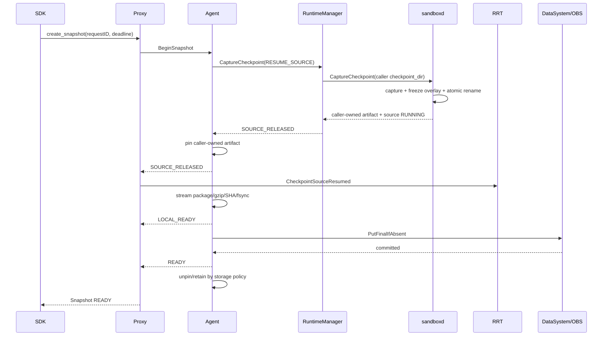

<!--
Copyright (c) Huawei Technologies Co., Ltd. 2026. All rights reserved.
Licensed under the Apache License, Version 2.0.
See the LICENSE file in this repository for the complete license text.
-->

# FS-Large-Firecracker-Checkpoint-20260829：大容量 Firecracker Checkpoint 优化设计

| 字段 | 值 |
|---|---|
| 编号 | FS-Large-Firecracker-Checkpoint-20260829 |
| 状态 | Phase 1 已实现并完成 standalone 验证；Phase 2/3 待后续实施 |
| SIG / 模块 | sandboxd、FunctionSystem、RRT、Frontend、Sandbox SDK |
| 创建日期 | 2026-08-29 |
| 基准版本 | `akernel-checkpoint:phase2-final`、FunctionSystem `106d5d33` |

## 1. 摘要

当前 release 已将 sandboxd checkpoint 固定为不压缩，并把 reusable Snapshot/Pause 的 gzip
与远端发布移动到 FunctionAgent 二阶段处理。该设计能保证 leave-running checkpoint 在
本地 raw checkpoint 完成后恢复源 sandbox，再执行压缩和上传，但 4 GiB Firecracker VM
实测仍暴露以下问题：

1. Firecracker native snapshot 之后的 raw 打包仍在源 VM 恢复前执行，高熵常驻内存场景
   VM 暂停约 28 秒；
2. FunctionAgent gzip 对 3 GiB 不可压缩制品耗时约 64 秒；
3. DataSystem temporary → final 发布同时保留两份完整对象，5.1 GiB standalone
   DataSystem 无法发布 3.03 GiB 制品；
4. DataSystem adapter 使用多个全量 `std::string`，FunctionProxy RSS 峰值达到约
   12.25 GiB；
5. Frontend 内部默认 60 秒 gRPC deadline 先于后台发布完成，SDK 获得 uncertain 503。

本提案将物理 snapshot capture、源 runtime 释放、本地 artifact 提交和远端 publication
拆为明确阶段。sandboxd 继续负责物理 VM capture，但 checkpoint artifact 写入调用方提供的目录；
完成 capture 后，目录所有权明确转移给 FunctionSystem。FunctionSystem 对自己管理的本地文件做
in-flight pin，并负责 fsync、raw/gzip artifact、缓存和远端发布，不需要 pin sandboxd 的堆内存。
DataSystem 改为单 final 对象提交，不再复制 temporary 对象。SDK checkpoint 仍同步等待 READY，
但 deadline 按请求贯穿，并提供 request ID reconcile。

Phase 1 已在独立 binary/wheel 中实现并验证；caller-owned native artifact 与 early source release
仍属于后续 Phase 2/3 范围。

## 2. 实测基线

环境：standalone、Firecracker、2 vCPU、4096 MiB VM、`distributed_cache`、DataSystem
shared-memory capacity 5235 MiB、sandboxd `compress=false`、FunctionAgent gzip level 1。

### 2.1 低熵内存

| 阶段 | 耗时 |
|---|---:|
| raw checkpoint 大小 | 4.004 GiB |
| Firecracker full snapshot API | 3.770 s |
| sandboxd archive/persist | 2.960 s |
| VM paused → resumed | 6.730 s |
| RuntimeManager request → LOCAL_READY | 7.025 s |
| LOCAL_READY → gzip/SHA 完成 | 5.175 s |
| DataSystem temporary + final | 约 0.32 s |
| SDK `create_snapshot` | 12.530 s，成功 |
| published artifact | 37.99 MiB，raw 的 0.927% |

### 2.2 3072 MiB 随机常驻内存

| 阶段 | 耗时 / 结果 |
|---|---:|
| raw checkpoint 大小 | 4.004 GiB |
| Firecracker full snapshot API | 4.361 s |
| sandboxd archive/persist | 23.877 s |
| VM paused → resumed | 28.240 s |
| RuntimeManager request → LOCAL_READY | 28.411 s |
| LOCAL_READY → gzip file 完成 | 64.193 s |
| compressed SHA256 inspection | 2.575 s |
| DataSystem temporary put | 9.578 s |
| DataSystem final publish | 21.120 s，Out of memory |
| Frontend/SDK deadline | 65.869 s，DeadlineExceeded |
| 后台最终失败 | 请求开始后 125.891 s |
| compressed artifact | 3.028 GiB，raw 的 75.61% |

DataSystem temporary 对象写入成功后，final publish 需要再创建一份约 3.25 GB 对象，峰值
容量超过 5235 MiB。发布期间 FunctionProxy RSS 从百 MiB 増至约 12.25 GiB，宿主内存使用
达到约 14 GiB，并使用约 220 MiB swap。

这些数字为单节点单次实测，用于暴露阶段边界和数量级，不作为跨硬件性能承诺。

## 3. 目标

- leave-running Firecracker checkpoint 的源服务恢复不等待 raw 打包、gzip、SHA 或上传；
- 物理 capture、源 runtime 状态、本地 artifact durable commit、远端 READY 均有独立阶段；
- 4 GiB snapshot 发布期间 FunctionProxy 附加 RSS 与 artifact 大小解耦；
- DataSystem 中一个逻辑 snapshot 最多持有一份完整 payload；
- `local_only` 不压缩、不上传；`distributed_cache` 和 `distributed_only` 只在 FunctionAgent
  中压缩；
- SDK 同步 checkpoint 等待远端 READY，并在网络或 deadline 不确定时可按 request ID
  reconcile；
- Pause 成功路径不发送源端 SnapStarted，任何发布失败均能恢复 PARKED source；
- 所有读取、压缩、上传和 restore 都有 FunctionSystem 本地 owner reference 与 in-flight pin；
  只有采用 sandboxd 私有存储实现时才需要跨组件 lease。

## 4. 非目标

- 本期不实现 Firecracker diff/incremental snapshot；
- 不改变 DataSystem server 的调度、复制或一致性模型；
- 不让 FunctionSystem 解析 `memory`、`vmstate` 等 Firecracker 语义；
- 不通过增加 standalone DataSystem 容量掩盖双对象发布问题；
- 不把固定 120/300 秒超时当作最终方案；
- 不把 GB 级 payload 放入 LiteBus actor message；
- 不在当前 release 分支直接修改 sandboxd 公共 wire contract。

## 5. 当前事实：artifact 在哪里

当前 sandboxd API 已明确把 `checkpoint_dir` 定义为 **caller-owned output directory**。实际
Firecracker checkpoint 顺序为：

1. sandboxd 在 `checkpoint_dir` 的父目录创建 `.firecracker-snapshot-*` 临时目录；
2. VM pause 后，Firecracker API 把 `vmstate` 和 `memory` 写成该目录内的普通文件；
3. sandboxd 在 VM 仍 paused 时，将 `vmstate`、`memory` 和可写 overlay 打包到
   `checkpoint_dir/checkpoint.img`；
4. sandboxd 对 `checkpoint.img` 执行 `Sync` 并关闭文件；
5. `leave_running=true` 时才 resume VM；
6. RPC 返回前删除 `.firecracker-snapshot-*` 临时目录。

所以这里不存在“FunctionSystem 需要 pin 住 sandboxd 内存”的问题：大容量 memory snapshot
是文件，不是 sandboxd heap buffer。当前 RPC 成功返回后，FunctionSystem 已经拥有完整的
`checkpoint.img`，sandboxd 不再读写它，也不需要额外 Acquire/Release。

真正的问题是第 3 步位于 pause 窗口内。高熵 4 GiB 场景中，Firecracker API 只占约 4.36 秒，
而 sparse tar 打包占约 23.88 秒，导致 VM 总暂停约 28.24 秒。

### 5.1 优化后的所有权边界

首选方案继续沿用 caller-owned directory，而不是把 artifact 改存到 sandboxd 私有目录：

```text
sandboxd 写 caller staging
  → 冻结完整 native artifact
  → 原子 rename 为 caller-owned CAPTURED directory
  → resume/park source
  → RPC 返回并完成所有权转移
  → FunctionSystem pin/fsync/package/compress/upload
```

sandboxd 在 RPC 返回前拥有 staging；RPC 成功返回后，FunctionSystem 独占 CAPTURED directory。
两者不并发修改同一文件，因此正常路径不需要跨组件 lease。

### 5.2 overlay 是提前恢复的硬前提

`vmstate` 和 `memory` 在 Firecracker `createSnapshot` 返回后已是稳定文件，但当前 checkpoint
还包含源 sandbox 的可写 overlay。若 VM resume 后再直接读取原 overlay，guest 写入会继续改变
它，最终 artifact 可能与 vmstate/memory 不一致。

因此 sandboxd 必须在 VM paused 期间先获得 overlay 的不可变视图，才可以提前恢复源 VM。
优先顺序为：

1. 文件系统 reflink/clone（同文件系统 CoW，优先）；
2. thin/LVM/device snapshot 等块设备快照；
3. sandbox storage backend 自身的 immutable snapshot；
4. 不支持快速冻结时回退当前行为，在 paused 状态完成 overlay copy/package。

禁止在没有 immutable overlay 的情况下先 resume 再打包。capability 必须准确反映 backend 是否
支持 `early-source-release`，不能仅根据 runtime class 推断。

### 5.3 FunctionSystem 的 pin

所有权转移后，FunctionAgent 的 artifact manager 维护本地引用：

- owner reference：逻辑 snapshot、本地缓存或 Pause record 仍引用该 artifact；
- in-flight pin：fsync、打包、压缩、上传或 restore 正在读取 artifact。

只有 owner count 和 in-flight count 同时为零，本地 LRU/GC 才能删除目录。这个 pin 保护的是
FunctionSystem 管理的文件生命周期，不会把 4 GiB 文件锁进内存；所有处理均按固定 chunk
读取。

如果未来 sandboxd 选择把 artifact 保留在自己的私有 storage root，而不是转移到 caller-owned
directory，届时才需要 handle + Acquire/Release lease。它是备选实现，不是本提案首选契约。

## 6. sandboxd 公共契约

本提案建议在现有 caller-owned `Checkpoint` 语义上增加 capture-only 输出模式。新字段必须是
backend-neutral 能力，不应暴露 sandboxd 内部绝对路径，也不应命名为 YuanRong 专属接口。
旧 unary `Checkpoint` 在兼容期继续保留。

### 6.1 CaptureCheckpoint

```proto
message LocalCheckpointArtifact {
  string format = 1;          // opaque-native-v1 / portable-tar-v1
  uint32 format_version = 2;
  string relative_root = 3;   // 必须位于请求的 checkpoint_dir 内
  uint64 logical_size = 4;
  ArtifactOwnership ownership = 5; // CALLER_OWNED
}

rpc CaptureCheckpoint(CaptureCheckpointRequest)
    returns (CaptureCheckpointResponse);

message CaptureCheckpointRequest {
  string request_id = 1;
  string sandbox_id = 2;
  string checkpoint_id = 3;
  SourcePolicy source_policy = 4; // RESUME_SOURCE / PARK_SOURCE
  int64 deadline_unix_ms = 5;
  string checkpoint_dir = 6;      // caller-owned
  ArtifactMode artifact_mode = 7; // NATIVE_DIRECTORY / PORTABLE_ARCHIVE
}

message CaptureCheckpointResponse {
  Status status = 1;
  string operation_id = 2;
  LocalCheckpointArtifact artifact = 3;
  SourceState source_state = 4; // RUNNING / PARKED
}
```

返回条件：

1. sandboxd 已完成 Firecracker native snapshot；
2. `RESUME_SOURCE` 已恢复 VM，`PARK_SOURCE` 保持 VM paused；
3. native artifact 和 immutable overlay 已进入调用方目录内的 CAPTURED directory；
4. sandboxd 未执行 gzip、远端上传或 FunctionSystem artifact fsync。

同一 `request_id + sandbox identity` 重放返回同一 operation；身份不匹配返回 conflict，不引入
generation。

`relative_root` 必须经过路径 containment 校验；FunctionSystem 只把目录视为 opaque artifact，
可以流式打包整个目录，但不解释 `memory`、`vmstate` 等 backend 文件名。

### 6.2 RestoreCheckpoint

Restore 继续从 caller-owned artifact 恢复：

```proto
rpc RestoreCheckpoint(RestoreCheckpointRequest)
    returns (RestoreCheckpointResponse);
```

FunctionSystem 从远端下载并解压到自己的 staging，fsync + rename 为 READY 后调用 Restore。
sandboxd 校验 format/version 并创建新物理 sandbox。若 capability 声明恢复过程只在 RPC 内读取
artifact，FunctionAgent 的 restore pin 可在成功返回后释放；若未来 runtime 在运行期仍依赖
artifact，则 pin 延长到 runtime 生命周期，不需要额外 `artifact released` 事件。

### 6.3 FinalizeCheckpoint

Pause 使用 `PARK_SOURCE`，capture 后不能立即删除 VM：

```proto
rpc FinalizeCheckpoint(FinalizeCheckpointRequest)
    returns (FinalizeCheckpointResponse);

enum CheckpointDecision { COMMIT = 0; ABORT = 1; }
```

- PARK + COMMIT：终止 PARKED VM，Pause 正式提交；
- PARK + ABORT：恢复 PARKED VM，FunctionSystem 执行 source rescue；
- RUNNING + COMMIT/ABORT：清理 request operation 状态，不影响源 VM 或 caller-owned artifact。

### 6.4 Capability

FunctionSystem 只有在 sandboxd 同时声明以下 capability 时使用新协议：

```text
checkpoint.capture-caller-owned.v1
checkpoint.immutable-overlay.v1
checkpoint.restore-caller-owned.v1
checkpoint.park-finalize.v1
```

只有同时具备 capture-caller-owned 和 immutable-overlay 时才允许 early source release；否则回退
到当前单阶段 `Checkpoint` 和 `Start(checkpoint_info)`。

## 7. FunctionSystem 配合

### 7.1 RuntimeManager

- FunctionSystem 内只有 RuntimeManager 持有 sandboxd client；
- Capture/Restore/Finalize 均由 RuntimeManager 适配；
- RuntimeManager 创建 caller-owned checkpoint directory，并校验 response 中的 relative path
  始终位于该目录内；
- RuntimeManager 不通过 LiteBus 搬运 payload，只传 artifact ID、relative path、format、size 和状态；
- 大文件操作由独立 ActorWorker 执行，不阻塞 actor mailbox；
- sandboxd operation 结果未知时按 request ID/List reconcile。

### 7.2 FunctionAgent

FunctionAgent 决定存储模式并持有 owner/in-flight pin：

| 模式 | 本地制品 | 远端制品 |
|---|---|---|
| `local_only` | raw portable artifact，fsync + 原子 rename | 无 |
| `distributed_cache` | published gzip artifact 进入 LRU | 同一 gzip 文件单对象上传 |
| `distributed_only` | 仅 publication staging，READY 后删除 | gzip 单对象 |

FunctionAgent 接收所有权后先 pin CAPTURED directory，再按固定 chunk 读取并生成自己的 staging
file：

```text
native files
  → portable raw stream
  → optional zlib deflate(level=1)
  → SHA256_Update(output chunk)
  → write staging
  → fsync(staging fd)
  → rename(staging, final)
  → fsync(parent directory)
```

gzip、size 和 SHA 在一次输出遍历中完成，不再完整二次读取 compressed file。

### 7.3 FunctionProxy

Proxy 处理四个阶段：

```text
SOURCE_RELEASED
LOCAL_READY
READY
FAILED
```

- reusable/internal checkpoint 在 `SOURCE_RELEASED + RUNNING` 后尽快恢复 RRT listener；
- `LOCAL_READY` 仅表示 FunctionAgent 本地 artifact 已 durable commit；
- `READY` 表示远端单对象发布完成；
- Pause 成功路径的 source state 为 PARKED，不发送源端恢复信号；
- Pause abort 时 Finalize(ABORT) 成功后执行 source rescue。

### 7.4 RRT

当前 SnapStarted 同时承担 listener rearm 和内部 checkpoint 完成，需拆分为：

```text
CheckpointSourceResumed
CheckpointCommitted
CheckpointFailed
```

- SourceResumed：重开 HTTP/checkpoint listener，但内部 curl 保持 pending；
- Committed：达到 LOCAL_READY，internal curl 返回成功；
- Failed：internal curl 返回失败，leave-running 源继续运行。

### 7.5 Frontend 与 Sandbox SDK

SDK 增加 per-request `timeout_seconds`，默认建议 300 秒。Frontend 不再固定使用 60 秒内部
gRPC deadline，而是把绝对 `deadline_unix_ms` 传到 Proxy、Agent、RuntimeManager、sandboxd
和远端存储。每层只使用剩余时间，不能重新获得完整 budget。

SDK 同步调用仍等待 READY。若 transport 中断或结果未知，提供按 request ID 查询：

```text
PREPARING / SOURCE_RELEASED / LOCAL_READY / PUBLISHING / READY / FAILED
```

## 8. DataSystem 单对象发布

当前 DataSystem adapter 的 temporary/final envelope 都包含完整 payload，Publish 还会完整 Get
temporary、复制 decoded payload、重新构造 final envelope。新接口改为后端一次性提交 final：

```cpp
PutFinalIfAbsent(finalKey, sourceFile, metadata, deadline)
```

流程：

1. Stat final；一致则幂等成功，不一致则 conflict；
2. create-if-absent final object；
3. 以固定 chunk 写小 header 与 file payload；
4. seal/publish 后一次性可见；
5. RPC 结果未知时再次 Stat final 并验证 identity/size/SHA。

不要求 DataSystem server 实现 rename。若当前公开 SDK 已能 Create buffer + Seal，改动只在
FunctionSystem adapter；否则只在 DataSystem SDK 增加 `PutFileIfAbsent/GetToFile/StatHeader`
薄接口，DataSystem server 的一致性与调度模型不变。

DataSystem Get 同样直接从只读 buffer 分块写入 FunctionSystem staging fd，不构造完整
`std::string`。

## 9. 端到端时序



Internal checkpoint 在 LOCAL_READY 后向 RRT 发送 CheckpointCommitted，不上传；Pause 使用
PARK_SOURCE，并在远端 READY 后 Finalize(COMMIT)。

## 10. 失败与恢复

| 失败点 | 源 VM | 处理 |
|---|---|---|
| capture 前失败 | 原状态 | 直接失败 |
| Firecracker capture 后、resume 失败 | UNKNOWN | sandboxd reconcile 物理状态，禁止盲目重试 |
| leave-running export/fsync 失败 | RUNNING | snapshot 失败，删除 caller-owned staging/制品，源继续运行 |
| remote upload 失败 | RUNNING/PARKED | reusable 源继续；Pause Finalize(ABORT) |
| Pause PARK 后 Agent/Proxy 失败 | PARKED | request ID replay 后决定 COMMIT/ABORT |
| FunctionAgent 在 pin 中崩溃 | 不变 | 启动时扫描 caller-owned staging；owner record 决定继续或 GC |
| sandboxd 在 response 前重启 | UNKNOWN | 按 request ID/List reconcile；未转移的 staging 由 sandboxd 清理 |
| sandboxd 在 response 后重启 | 不变 | artifact 已归 FunctionSystem，不影响 fsync/upload |
| SDK transport 超时 | 后台继续至 deadline | 按 request ID 查询，不自动创建新 snapshot |

staging 文件永远不进入 List/Restore；只有 FunctionAgent fsync + rename 后的 artifact 才是
LOCAL_READY。远端 final object 不存在或 metadata 不匹配时不得将 Master 状态改为 READY。

## 11. 可观测性

每个阶段统一记录 request ID、snapshot ID、artifact ID、backend、bytes 和 duration：

```text
checkpoint.capture_ms
checkpoint.source_release_ms
checkpoint.package_ms
checkpoint.compress_ms
checkpoint.digest_ms
checkpoint.local_fsync_ms
checkpoint.remote_put_ms
checkpoint.remote_commit_ms
checkpoint.total_ms
checkpoint.raw_bytes
checkpoint.published_bytes
checkpoint.proxy_peak_rss_bytes
```

日志必须区分 SOURCE_RELEASED、LOCAL_READY、READY 和 FAILED，不再仅打印单一
`SnapshotRuntimeResponse code=0`。

## 12. 分阶段实施

### Phase 1：发布容量与内存

状态：**已完成（2026-08-29）**。

- FunctionSystem DataSystem 单 final object；
- file/buffer chunk 传输，移除完整 payload `std::string`；
- gzip 与 SHA 单遍处理；
- per-request absolute deadline 和 request ID reconcile；
- 增加阶段 metrics。

Phase 1 不修改 sandboxd capture 时序，可先解决 3 GiB artifact 无法发布和 FunctionProxy RSS
问题。

### Phase 2：caller-owned native artifact 与早恢复

- sandboxd Capture/Finalize caller-owned 公共 API；
- Firecracker overlay immutable snapshot/reflink 与 capability；
- RuntimeManager adapter 与 capability fallback；
- FunctionAgent owner/in-flight pin pipeline；
- Proxy/RRT SourceResumed 与 Committed 拆分；
- Pause PARK/COMMIT/ABORT。

### Phase 3：Restore 与统一缓存

- caller-owned artifact Restore；
- local-only、distributed-cache、distributed-only 完整策略；
- restore in-flight pin、LRU 和 orphan reconcile。

### Phase 4：增量快照（可选）

- Firecracker dirty-page tracking；
- base + diff chain；
- 链长阈值与后台 compaction；
- 跨节点 materialization 验证。

## 13. 验收标准

在与本次压测等价的 4096 MiB Firecracker sandbox 上：

- leave-running VM 停顿目标接近 Firecracker native capture，初始目标 p95 ≤ 6 秒；
- 3 GiB 高熵常驻内存制品在 5235 MiB DataSystem 配置中成功发布；
- DataSystem 完整 payload 峰值 ≤ 1.1 × published artifact size；
- FunctionProxy 因 snapshot pipeline 产生的附加 RSS ≤ 512 MiB；
- SDK 默认 deadline 内同步返回 READY，或按 request ID 得到确定 FAILED；
- SDK transport 中断后 replay/reconcile 不产生第二份 snapshot；
- `local_only` 日志和 DataSystem/OBS 均无 gzip/upload；
- internal checkpoint 在 SourceResumed 后服务恢复，但只有 LOCAL_READY 后 curl 返回成功；
- Pause 成功无源端恢复信号；任一发布失败均恢复原状态；
- concurrent restore、LRU eviction、Agent/Proxy/sandboxd 重启不删除 in-flight artifact；
- early source release 前已创建 immutable overlay，并通过持续 guest 写入故障注入验证一致性；
- 所有失败场景最终 owner=0、pin=0、staging=0、remote orphan=0。

## 14. 兼容与发布策略

- 新 sandboxd capability 与 FunctionSystem adapter 必须同批次 release；
- FunctionSystem 对旧 sandboxd 保留当前 Checkpoint/Start fallback；
- 新 FunctionSystem 不得仅根据 runtime class 假设能力，必须使用 sandboxd ListCapabilities；
- sandboxd、FunctionSystem、RRT、Frontend、SDK 分别提交并通过各自仓库验证；
- standalone 先验证，再进入 K8S/多节点/故障注入；
- 当前 `106d5d33` release 行为作为 A/B baseline，不在本优化中回写或重解释其结果。

## 15. 实施前待确认

1. DataSystem SDK 是否已公开 create mutable buffer + seal/create-if-absent；
2. 当前 standalone checkpoint 文件系统是否稳定支持 reflink，以及不支持时采用哪种 overlay
   snapshot backend；
3. caller-owned native artifact 的 format/version 如何跨 sandboxd minor version 协商；
4. distributed-cache 默认缓存 gzip artifact 还是额外保留 native fast-restore directory；
5. Frontend/SDK 默认 checkpoint deadline 与最大允许值；
6. Firecracker capture + immutable overlay 后立即 resume 对所有设备的一致性保证；
7. 旧 SnapStarted wire 的兼容期和 SourceResumed/Committed capability 协商方式。

## 16. 当前实现依据

- `sandboxd/api/runtime/v1/sandbox-api.proto`：`Checkpoint` 和 `checkpoint_dir` 均明确声明为
  caller-owned，且 response 只在完整 artifact 生成后返回；
- `sandboxd/internal/server/checkpoint.go`：server 校验/创建调用方目录，将其传给 runtime handler，
  失败时清理本次创建的残留目录；
- `sandboxd/pkg/runtime/firecracker/checkpoint_handler.go`：VM pause 后创建临时 `vmstate`/`memory`
  文件，直接引用当前 overlay，完成 archive 后才在 `leave_running=true` 路径 resume；临时目录由
  `defer os.RemoveAll` 清理；
- `sandboxd/pkg/runtime/firecracker/checkpoint.go`：archive 由普通文件、tar 与可选 gzip 组成，末尾
  执行 `image.Sync()` 和 `Close()`。因此当前 pin 对象不是内存，而是后续优化中由
  FunctionSystem 接管的 caller-owned 文件目录。

## 17. Phase 1 standalone 验证结果

最终候选镜像：`akernel-checkpoint:phase3-large-checkpoint-madvise`。环境为 4096 MiB
Firecracker VM、3072 MiB 随机常驻内存、5235 MiB DataSystem shared memory、
`distributed_cache`。

| 项目 | 结果 |
|---|---:|
| raw checkpoint | 4,299,453,952 bytes |
| gzip publication artifact | 3,250,989,101 bytes |
| RuntimeManager capture → LOCAL_READY | 约 32 s |
| gzip + SHA 单遍处理 | 59.458 s |
| DataSystem 单 final create/fill/set | 3.089 s |
| SDK checkpoint | 91.351 s（PASS） |
| FunctionProxy VmHWM | 167,348 KiB |
| FunctionProxy peak PSS | 154,632 KiB |
| FunctionProxy peak anonymous PSS | 102,508 KiB |
| FunctionProxy peak shared-memory PSS | 718 KiB |

DataSystem access log对该 3.03 GiB artifact 仅出现一次 `GET(miss) → CREATE → SET → GET`，
没有 temporary payload 对象或第二次完整 final copy。删除 snapshot 后 final object 与本地 raw
artifact 均被清理。

功能回归同时通过：

- reusable checkpoint → restore，恢复状态与 snapshot 时一致；
- Pause → Resume，logical sandbox ID、业务状态和路由恢复正确；
- RRT 内部 curl checkpoint 后 Firecracker failover 重拉，physical sandbox ID 变化且状态一致；
- command 内触发 checkpoint 并随机失败后，SDK reload 一次收敛，marker、随机决策和业务状态
  保持一致，重试成功；
- 所有验证清理后 `sbox list`、checkpoint directory 和 Firecracker 进程均无残留。
